# TradeStreamEE: High-Frequency Trading Reference Architecture

TradeStreamEE demonstrates how Jakarta EE applications can achieve low-latency, high-throughput performance by combining modern messaging (Aeron), efficient serialization (SBE), and a concurrent garbage collector (Azul C4).

It simulates a high-frequency trading dashboard that ingests tens of thousands of market data messages per second, processes them in real-time, and broadcasts updates to a web frontend without the latency spikes associated with traditional Java garbage collection.

## The Core Technologies

TradeStreamEE achieves high performance by combining four key technologies:

### Aeron (Transport)

Ultra-low latency messaging that bypasses the network stack when components run on the same machine. Data moves directly through shared memory instead of through kernel networking.

### SBE (Serialization)

Simple Binary Encoding - the financial industry standard for high-frequency trading. Encodes data as compact binary rather than human-readable text, eliminating parsing overhead and reducing memory allocation.

### Payara Micro (Jakarta EE Runtime)

A cloud-native Jakarta EE 11 application server that provides Jakarta CDI for dependency injection, Jakarta WebSocket for real-time browser communication, and Jakarta REST for REST endpoints. Lightweight (~100MB) and fast-starting.

### Azul Platform Prime (Runtime)

A JVM with the C4 garbage collector that performs cleanup concurrently with application execution, avoiding the "stop-the-world" pauses that cause latency spikes in traditional JVMs.

**How they work together:** Payara Micro manages the Aeron publisher/subscriber lifecycle via CDI. The publisher encodes market data into binary using SBE, sends it through Aeron's shared memory transport, and the subscriber decodes it without allocating Java objects. This minimal garbage generation allows C4's concurrent collection to handle cleanup while maintaining flat latency at high throughput.

## Project Motivation

Enterprise Java applications must often balance two competing requirements:

1. High Throughput: Ingesting massive data streams (IoT, Financial Data).
2. Low Latency: Processing data without "Stop-the-World" pauses.

Standard JVMs (using G1GC or ParallelGC) can exhibit latency spikes under high load, potentially causing UI freezes or missed SLAs. TradeStreamEE demonstrates that by combining a modern, broker-less transport (Aeron) with a pauseless runtime (Azul C4), standard Jakarta EE applications can achieve microsecond-level latency and high throughput.

### Comparison Methodology

This project facilitates a side-by-side JVM comparison using identical architectural choices:

* **Architecture:** Both clusters use AERON IPC + Zero-Copy SBE by default.
* **Ingestion:** Both clusters support `DIRECT` mode (naive string processing) via the `TRADER_INGESTION_MODE` flag.
* **Variable:** The only difference is the JVM (Azul C4 vs Standard G1GC).

This isolation ensures that observed performance differences are attributable solely to the Garbage Collector.

## Quick Start

### Primary Use Case: Side-by-Side JVM Comparison

TradeStreamEE enables side-by-side JVM comparison by deploying both clusters simultaneously under identical workloads. Both clusters execute the same application binary and configuration, isolating the garbage collector as the sole variable. This approach allows for real-time observation of performance differences in a shared environment, providing a more objective comparison than traditional serial benchmarking.

```bash
./start-comparison.sh all
```

This command builds and deploys both the Azul C4 cluster (ports 8080-8083) and the G1GC cluster (ports 9080-9083), along with the complete monitoring stack (Prometheus, Grafana, Loki).

Once deployed, access the applications:

- **C4 Cluster:** http://localhost:8080/trader-stream-ee/
- **G1 Cluster:** http://localhost:9080/trader-stream-ee/

The "GC Pause Time (Live)" chart in Grafana will demonstrate the performance characteristics: C4 typically maintains a consistent latency profile, while G1GC may exhibit spikes and sawtooth patterns under load.

Other options:

- `./start-comparison.sh` - Clusters only, no monitoring stack (faster for rapid development)
- `./stop-comparison.sh` - Stop all comparison services

---

### Single-JVM Testing (start.sh)

Use `./start.sh` for testing individual configurations or architectural modes. This runs ONE JVM at a time for focused testing.

| Scenario                 | Command                      | JVM                 | Architecture      | Purpose                                                          |
|:-------------------------|:-----------------------------|:--------------------|:------------------|:-----------------------------------------------------------------|
| Modern Stack             | `./start.sh azul-aeron`      | Azul Prime (C4)     | Aeron (Optimized) | Peak performance with pauseless GC + zero-copy transport         |
| Legacy Baseline          | `./start.sh standard-direct` | Standard JDK (G1GC) | Direct (Heavy)    | Baseline: high allocation on G1GC, expect jitter                 |
| Fixing Legacy Code       | `./start.sh azul-direct`     | Azul Prime (C4)     | Direct (Heavy)    | Show how C4 stabilizes high-allocation apps without code changes |
| Optimizing Standard Java | `./start.sh standard-aeron`  | Standard JDK (G1GC) | Aeron (Optimized) | Test if architectural optimization helps G1GC performance        |

Utilities:

- `./start.sh logs` - View live logs
- `./start.sh stop` - Stop containers
- `./start.sh clean` - Deep clean (remove volumes/images)

## Technical Architecture

The application implements a Hybrid Architecture:

1. Ingestion Layer (Broker-less):
   * Uses Aeron IPC (Inter-Process Communication) via an Embedded Media Driver.
   * Bypasses the network stack for ultra-low latency between components.
2. Serialization Layer (Zero-Copy):
   * Uses Simple Binary Encoding (SBE).
   * Decodes messages directly from memory buffers (Flyweight pattern) without allocating Java Objects, reducing GC pressure.
3. Application Layer (Jakarta EE 11):
   * Payara Micro 7 serves as the container.
   * CDI manages the lifecycle of the Aeron Publisher and Subscriber.
   * **Jakarta Concurrency 3.1** leverages Virtual Threads for high-throughput memory pressure simulation.
   * WebSockets push updates to the browser.
4. Runtime Layer:
   * Azul Platform Prime uses the C4 Collector to clean up the "garbage" created by the WebSocket layer concurrently, ensuring a flat latency profile.

## Tech Stack

| Component  | Technology                          | Role                                    |
|:-----------|:------------------------------------|:----------------------------------------|
| Runtime    | Azul Platform Prime (Zulu Prime 21) | The Pauseless JVM engine.               |
| App Server | Payara Micro 7 (Jakarta EE 11)      | Cloud-native Jakarta EE runtime.        |
| Transport  | Aeron                               | Low-latency, high-throughput messaging. |
| Encoding   | SBE (Simple Binary Encoding)        | Binary serialization (FIX standard).    |
| Frontend   | HTML5 / Chart.js                    | Real-time visualization via WebSockets. |
| Build      | Docker / Maven                      | Containerized deployment.               |

## Ingestion Architectures

The application supports two ingestion architectures, configurable via the `TRADER_INGESTION_MODE` environment variable (`AERON` or `DIRECT`). Both Azul C4 and G1GC clusters can run either mode, allowing for flexible performance testing.



```mermaid
graph TD
    subgraph DIRECT["DIRECT Mode (High Allocation)"]
        D1[Publisher] --> D2["JSON + 1KB padding"]
        D2 --> D3[Broadcaster]
        D3 --> D4["WebSocket → Browser"]
    end

    subgraph AERON["AERON Mode (Zero-Copy, Default)"]
        A1[Publisher] --> A2["SBE Binary"]
        A2 --> A3["Aeron IPC"]
        A3 --> A4["Fragment Handler"]
        A4 --> A5[Broadcaster]
        A5 --> A6["WebSocket → Browser"]
    end

    classDef heavy fill:#dc3545,stroke:#c82333,stroke-width:2px,color:#fff
    classDef optimized fill:#28a745,stroke:#218838,stroke-width:2px,color:#fff

    class D1,D2,D3,D4 heavy
    class A1,A2,A3,A4,A5,A6 optimized
```

### 1\. DIRECT Mode (The "Heavy" Path)

Goal: Simulate a standard, naive enterprise application with high object allocation rates.
Use for: Stress-testing GC behavior under high allocation pressure.

How it works:

1. Publisher generates synthetic market data as POJOs
2. Allocation converts data to JSON `String` using `StringBuilder` (high allocation)
3. Artificial Load wraps JSON in 1KB padding to stress the Garbage Collector
4. Transport via direct method call to `MarketDataBroadcaster`
5. WebSocket pushes heavy JSON to browser

Performance Characteristics:

- High Allocation: Gigabytes of temporary String objects per second
- GC Pressure: Frequent pauses on G1GC; C4's concurrent collection avoids stop-the-world pauses but still performs work

### 2\. AERON Mode (The "Optimized" Path, Default)

Goal: Low-latency financial pipeline using off-heap memory and zero-copy semantics.
Use for: Production-grade performance with minimal GC impact.

How it works:

1. Publisher generates synthetic market data
2. SBE Encoder writes binary format to off-heap direct buffer (zero-copy)
3. Aeron IPC publishes to shared memory ring buffer (kernel bypass)
4. Fragment Handler reads using SBE "Flyweights" (reusable views, no allocation)
5. Transformation converts to compact JSON for WebSocket
6. WebSocket pushes lightweight JSON to browser

Performance Characteristics:

- Low Allocation: Almost no garbage in the ingestion hot-path
- High Throughput: Aeron IPC handles millions of messages/sec with sub-microsecond latency
- Both JVMs benefit from reduced allocation, but C4 maintains flat latency profile

## Configuration & Tuning

You can tweak the performance characteristics via `docker-compose.yml` or the `.env` file (if created).

### Ingestion Modes (`TRADER_INGESTION_MODE`)

Controls how data moves from the Publisher to the Processor.

* `AERON` (Default): Uses the high-speed binary ring buffer.
* `DIRECT`: Bypasses Aeron; generates Strings directly in the Publisher loop. Useful for isolating Transport vs. GC overhead.

### JVM Tuning & Configuration

Heap size varies by deployment type:

| Deployment                            | Dockerfiles                                     | Heap Size | Reason                                                  |
|:--------------------------------------|:------------------------------------------------|:----------|:--------------------------------------------------------|
| **Single Instance** (`start.sh`)      | `Dockerfile`, `Dockerfile.standard`             | 8GB       | Full heap for maximum throughput                        |
| **Clustered** (`start-comparison.sh`) | `Dockerfile.scale`, `Dockerfile.scale.standard` | 4GB       | Balanced for 3-instance deployments (~12GB per cluster) |

**Common JVM options:**

```dockerfile
# Azul Prime (C4) - 8GB single instance example
ENV JAVA_OPTS="-Xms8g -Xmx8g -XX:+AlwaysPreTouch -XX:+UseTransparentHugePages -Djava.net.preferIPv4Stack=true"

# Standard JDK (G1GC) - 4GB cluster example
ENV JAVA_OPTS="-Xms4g -Xmx4g -XX:+UseG1GC -XX:+AlwaysPreTouch -XX:+UseTransparentHugePages -Djava.net.preferIPv4Stack=true"
```

Infrastructure improvements:

- Pre-touch Memory (`-XX:+AlwaysPreTouch`): Pre-allocates heap pages to eliminate runtime allocation overhead
- Transparent Huge Pages (`-XX:+UseTransparentHugePages`): Reduces TLB misses for large memory operations
- GC Logging: Detailed event logging with decorators for analysis
- Rate-Limited Logging: Prevents log flooding during high-throughput operations

Note: Azul Platform Prime uses C4 by default; we don't specify `-XX:+UseZGC` since C4 is the native, optimized collector for Azul Prime.

### GC Monitoring & Stress Testing

The application includes comprehensive GC monitoring and memory pressure testing capabilities to demonstrate JVM performance differences:

#### GC Statistics Collection

GCStatsService collects real-time garbage collection metrics via JMX MXBeans:

* Collection Metrics: Total collection count and time for each GC type
* Pause Time Analysis: Individual pause durations with percentile calculations (P50, P95, P99, P99.9, Max)
* Memory Usage: Heap memory utilization (total, used, free)
* Recent Pause History: Last 100 pause times for trend analysis
* GC Phase Breakdown: Sub-phase timing analysis for detailed performance investigation (vendor-specific)

#### Memory Pressure Stress Testing

MemoryPressureService generates controlled memory allocation to create realistic GC stress:

**Stress Test Patterns:**

The service rotates through four high-churn allocation patterns designed to maximize Garbage Collection pressure:

* **String Churn:** High-frequency creation and concatenation of short-lived Strings.
* **Byte Array Churn:** Rapid allocation and discard of primitive byte arrays.
* **Object Graph Churn:** Creation of nested object structures to stress reference tracing.
* **Collection Churn:** High-volume addition/removal of elements in standard Java Collections.

Allocation Modes with Coordinated Bursts:

* OFF: No additional allocation
* LOW: 2 MB/sec - Light pressure (3x bursts every 5 seconds)
* MEDIUM: 20 MB/sec - Moderate pressure (3x bursts every 5 seconds)
* HIGH: 1 GB/sec - Heavy pressure (3x bursts every 5 seconds)
* EXTREME: 4 GB/sec - Extreme pressure (3x bursts every 5 seconds)

Burst Scenarios: All active modes include coordinated allocation bursts (3x multiplier every 5 seconds) to simulate market events like flash crashes, sudden volume spikes, or news-driven trading surges.

Each mode uses parallel virtual threads to generate load, allowing observation of:

* C4's concurrent collection vs G1GC's "stop-the-world" pauses under heavy allocation
* Latency impact during burst scenarios
* Throughput degradation patterns with different object types
* Long-lived object promotion patterns (tenured generation stress)

#### GC Challenge Mode

The web UI includes GC Challenge Mode controls that allow:

* Real-time switching between allocation modes
* Visual feedback showing current stress level and burst activity
* Side-by-side pause time visualization with phase breakdown
* Immediate observation of collector behavior under realistic HFT load

This feature enables live demonstration of collector behavior under HFT-realistic memory pressure with coordinated bursts, allowing comparison of C4's pause times versus G1GC's behavior during market event simulations.

## Monitoring & Observability

When running `./start-comparison.sh all`, the following monitoring stack is deployed:

| Component         | Access                              | Purpose                       |
|:------------------|:------------------------------------|:------------------------------|
| Grafana Dashboard | http://localhost:3000 (admin/admin) | JVM comparison dashboards     |
| Prometheus        | http://localhost:9090               | Metrics collection            |
| Loki              | http://localhost:3100               | Log aggregation               |
| C4 Application    | http://localhost:8080 (Traefik LB)  | Azul C4 cluster (3 instances) |
| G1 Application    | http://localhost:9080 (Traefik LB)  | G1GC cluster (3 instances)    |

Direct instance access:

- C4 instances: http://localhost:8081, http://localhost:8082, http://localhost:8083
- G1 instances: http://localhost:9081, http://localhost:9082, http://localhost:9083

### Stress Testing

Use the UI or API to apply memory pressure and observe GC behavior differences:

```bash
# Apply extreme memory pressure via API
curl -X POST http://localhost:8080/api/pressure/mode/EXTREME    # C4 cluster
curl -X POST http://localhost:9080/api/pressure/mode/EXTREME    # G1GC cluster

# Get current GC statistics (includes phase breakdown)
curl http://localhost:8080/api/gc/stats
curl http://localhost:9080/api/gc/stats

# Available modes: OFF, LOW, MEDIUM, HIGH, EXTREME
# Allocation rates: 0 MB/s, 2 MB/s, 20 MB/s, 1 GB/s, 4 GB/s
# All active modes include 3x allocation bursts every 5 seconds
```

## Project Structure

```text
src/main/
├── java/fish/payara/trader/
│   ├── aeron/          # Aeron Publisher, Subscriber, FragmentHandler
│   ├── sbe/            # Generated SBE Codecs (Flyweights)
│   ├── websocket/      # Jakarta WebSocket Endpoint
│   ├── rest/           # Status, GC Stats, and Memory Pressure Resources
│   ├── gc/             # GC statistics collection and monitoring
│   ├── pressure/       # Memory pressure testing services
│   │   └── patterns/   # HFT allocation patterns (OrderBook, MarketTick, MarketDepth)
│   └── monitoring/     # GC monitoring services (GCPauseMonitor, MemoryPressure)
├── resources/sbe/
│   └── market-data.xml # SBE Schema Definition
└── webapp/
    └── index.html      # Dashboard UI (Chart.js + WebSocket)

monitoring/
├── grafana/
│   ├── provisioning/   # Grafana datasources and dashboard configs
│   └── dashboards/     # Pre-configured JVM comparison dashboard
├── jmx-exporter/       # JMX exporter configuration and JAR
├── prometheus/         # Prometheus configuration
├── loki/              # Loki log aggregation config
└── promtail/          # Promtail log shipping config

start-comparison.sh           # Automated deployment script for JVM comparison
stop-comparison.sh            # Stop script for comparison services
docker-compose-c4.yml          # Azul Prime C4 cluster setup
docker-compose-g1.yml          # Eclipse Temurin G1GC cluster setup
docker-compose-monitoring.yml  # Monitoring stack (Prometheus, Grafana, Loki)
Dockerfile.scale               # Multi-stage build for C4 instances
Dockerfile.scale.standard      # Build for G1GC instances
```

## Testing & Quality Assurance

### Quick Test Execution

```bash
# Quick test (unit tests only, ~30 seconds)
./test.sh quick

# Full test suite (unit + integration, 2-5 minutes)
./test.sh full

# Maven commands
./mvnw test                    # Unit tests
./mvnw jacoco:report          # Generate coverage report
```

### Current Test Coverage

Working Tests (182/182 passing):

- Monitoring & GC: Full coverage of SLA monitoring logic and GC notification handling.
- REST Resources: Comprehensive tests for Memory Pressure and GC Stats endpoints.
- Core Logic: Validated `AllocationMode` and concurrency configurations.
- WebSockets: Verified `MarketDataBroadcaster` functionality and session management.

Coverage Metrics:

- Tests: 182 unit tests with 100% pass rate
- Monitoring Coverage: >90% (SLAMonitor, GCStatsService)
- REST API Coverage: >85% (Resources and DTOs)
- Instruction Coverage: High coverage for business logic; integration logic relies on `test.sh`.

### Test Categories

1. Unit Tests: Core component testing in isolation (`src/test/java`)
2. Integration Tests: Service layer interactions and resource validation
3. Performance Tests: Load testing and benchmarks via scripts
4. Memory Pressure Tests: GC behavior validation and stress scenarios

## Trading Terms Glossary

For readers unfamiliar with high-frequency trading concepts, this glossary explains the domain-specific terms used throughout this project.

### Market Data & Trading

| Term                          | Definition                                                                                                                                                                                                                                                                    |
|:------------------------------|:------------------------------------------------------------------------------------------------------------------------------------------------------------------------------------------------------------------------------------------------------------------------------|
| High-Frequency Trading (HFT)  | Automated trading strategies that execute thousands or millions of orders per second, requiring sub-millisecond latency. HFT systems are extremely sensitive to processing delays, making garbage collection pauses a critical performance concern.                           |
| Order Book / Limit Order Book | A data structure containing all buy and sell orders for a security, organized by price level. Each price level (e.g., $100.50) contains multiple orders waiting to be filled. Order books are updated thousands of times per second in active markets.                        |
| Bid                           | The highest price a buyer is willing to pay for a security.                                                                                                                                                                                                                   |
| Ask                           | The lowest price a seller is willing to accept.                                                                                                                                                                                                                               |
| Bid-Ask Spread                | The difference between bid and ask prices, representing the cost of immediate execution.                                                                                                                                                                                      |
| Market Tick / Price Tick      | A single price update event in the market. High-frequency systems process tens of thousands of ticks per second, with each tick containing price, volume, and timestamp information.                                                                                          |
| L1 Data (Level 1)             | Best bid and ask prices only (top of book).                                                                                                                                                                                                                                   |
| L2 Data (Level 2)             | Multiple price levels showing aggregate size at each price (market depth).                                                                                                                                                                                                    |
| L3 Data (Level 3)             | Individual orders at each price level (full order book).                                                                                                                                                                                                                      |
| Price Ladder                  | The hierarchical structure of bid and ask prices in an order book. Bid prices decrease as you move away from the best bid; ask prices increase as you move away from the best ask.                                                                                            |
| Crossed Market                | An abnormal market condition where the best bid price is higher than the best ask price. This should never occur in normal trading and indicates a data error or system malfunction.                                                                                          |
| Flash Crash                   | A sudden, severe market downturn followed by rapid recovery, often triggered by algorithmic trading systems. The 2010 Flash Crash saw the Dow Jones drop nearly 1,000 points in minutes. These events create extreme allocation bursts as systems process massive order flow. |

### Memory & Performance

| Term                              | Definition                                                                                                                                                                                              |
|:----------------------------------|:--------------------------------------------------------------------------------------------------------------------------------------------------------------------------------------------------------|
| Allocation Rate                   | The speed at which a program creates new objects in memory, measured in bytes per second (e.g., "2 GB/sec allocation rate"). Higher allocation rates increase garbage collection pressure.              |
| GC Pressure / Memory Pressure     | The workload placed on the garbage collector due to object allocation. Higher pressure leads to more frequent garbage collection cycles and potentially longer pause times.                             |
| Pause Time / Stop-the-World Pause | Duration when a garbage collector halts all application threads to perform cleanup. For HFT systems, even millisecond-level pauses can cause missed trading opportunities or regulatory violations.     |
| Concurrent Collection             | Garbage collection that runs simultaneously with application threads, avoiding stop-the-world pauses. Azul C4 is a concurrent collector; G1GC uses stop-the-world pauses.                               |
| Allocation Burst / Burst Scenario | Sudden spikes in memory allocation, simulating events like market opens, news releases, or flash crashes. This project uses 3x allocation multipliers every 5 seconds to simulate these conditions.     |
| Tenured Objects / Old Generation  | Long-lived objects that survive multiple garbage collection cycles and are promoted to the "old generation" heap region. Order books are typically tenured since they persist across many tick updates. |

### Data Structures & Patterns

| Term                               | Definition                                                                                                                                                                                               |
|:-----------------------------------|:---------------------------------------------------------------------------------------------------------------------------------------------------------------------------------------------------------|
| Columnar Storage / Columnar Format | Storing data by column rather than by row (e.g., all prices in one array, all volumes in another). This improves cache locality and enables SIMD operations. Our `MarketTickPattern` uses this approach. |
| Flyweight Pattern                  | A design pattern that reuses objects to minimize memory allocation. SBE codecs use flyweights, they're views over byte buffers rather than allocated objects.                                            |
| Zero-Copy                          | Data processing without copying bytes between buffers. Aeron IPC and SBE both use zero-copy techniques to minimize allocation and improve throughput.                                                    |
| Hierarchical Object Graph          | Objects containing references to other objects in a tree structure. Our `OrderBookPattern` creates these: OrderBook, PriceLevel[], Order[].                                                              |

### Serialization & Messaging

| Term                                    | Definition                                                                                                                                                                        |
|:----------------------------------------|:----------------------------------------------------------------------------------------------------------------------------------------------------------------------------------|
| SBE (Simple Binary Encoding)            | A binary serialization format designed for financial trading systems. FIX (Financial Information eXchange) protocol organization standardized it for ultra-low-latency scenarios. |
| Aeron IPC (Inter-Process Communication) | A messaging transport that uses shared memory for same-machine communication, bypassing kernel networking overhead. Achieves sub-microsecond latency.                             |
| Message Batching                        | Grouping multiple messages together for efficient processing. Our `MarketTickPattern` simulates batches of 50-200 ticks processed together.                                       |

### Performance Metrics

| Term                  | Definition                                                                                                                                                                          |
|:----------------------|:------------------------------------------------------------------------------------------------------------------------------------------------------------------------------------|
| Latency               | The time delay between an event occurring and the system responding. HFT systems target sub-millisecond (< 1ms) latency for end-to-end trade execution.                             |
| Throughput            | The volume of work completed per unit time (e.g., "1 million messages per second"). HFT systems require both high throughput and low latency simultaneously.                        |
| P50 (Median)          | 50% of requests complete faster than this value.                                                                                                                                    |
| P95 (95th Percentile) | 95% of requests complete faster than this value (1 in 20 is slower).                                                                                                                |
| P99 (99th Percentile) | 99% of requests complete faster than this value (1 in 100 is slower).                                                                                                               |
| Jitter                | Variability in latency. Even with good average latency, high jitter (unpredictable spikes) is unacceptable for HFT. G1GC tends to show jitter under load; C4 maintains consistency. |

### Trading System Architecture

| Term                                 | Definition                                                                                                                                                                 |
|:-------------------------------------|:---------------------------------------------------------------------------------------------------------------------------------------------------------------------------|
| Ingestion Pipeline / Ingestion Layer | The component responsible for receiving and processing incoming market data feeds. Must handle extreme throughput (millions of messages/sec) with minimal latency.         |
| Hot Path / Critical Path             | The code execution path that runs most frequently and must be highly optimized. In HFT, the ingestion and order routing paths are hot paths where even nanoseconds matter. |
| Market Event                         | Significant market occurrences that trigger increased trading activity: market open/close, economic announcements, earnings releases, or sudden price movements.           |
| SLA (Service Level Agreement)        | Performance guarantees, such as "99.9% of trades execute within 5ms". GC pauses can cause SLA violations if they exceed latency budgets.                                   |

## License

This project is a reference implementation provided for demonstration purposes.
