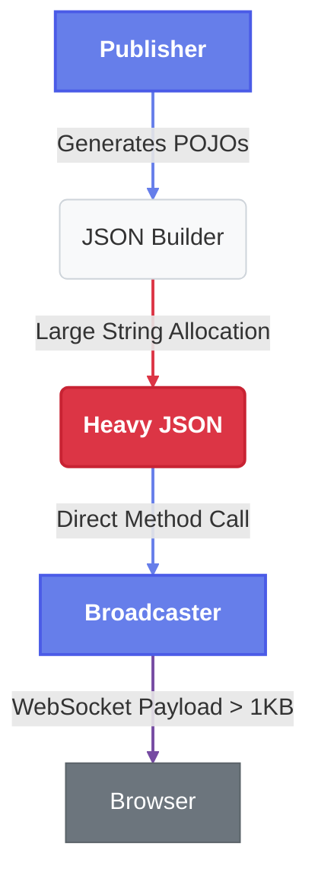
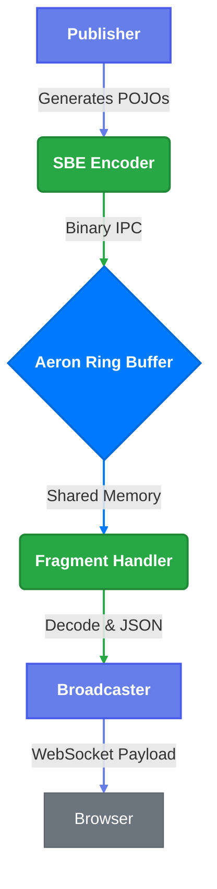

# TradeStreamEE: High-Frequency Trading Reference Architecture

**TradeStreamEE** is a technical demonstration application designed to showcase the "Pauseless Performance" symbiosis between **Payara Server Enterprise** (Jakarta EE) and **Azul Platform Prime** (High-Performance JVM).

It simulates a high-frequency trading (HFT) dashboard that ingests tens of thousands of market data messages per second, processes them in real-time, and broadcasts updates to a web frontend—all without the latency spikes ("jitter") associated with standard Java Garbage Collection.


## ⚡ The Core Technologies

TradeStreamEE gets its speed by removing the middleman. We swapped out heavy, traditional methods (REST/JSON) for 'Mechanical Sympathy', an approach that respects the underlying hardware to squeeze out maximum efficiency.

### 1\. What is Binary Encoding?

Computers do not natively understand text; they understand bits.

* **Text Encoding (JSON/XML):** Easy for humans (`{"price": 100}`), but expensive for computers. The CPU must parse every character, handle whitespace, and convert strings to numbers. This burns CPU cycles and creates massive amounts of temporary memory "garbage."
* **Binary Encoding:** Stores data exactly as the machine represents it in memory (e.g., `100` is stored as 4 raw bytes). No parsing is required. This results in **deterministic latency** and significantly reduced CPU usage.

### 2\. Aeron (The Transport)

[Aeron](https://aeron.io/) is a peer-to-peer, broker-less transport protocol designed for **ultra-low latency** applications.

* **Broker-Less:** There is no central server "middleman." The Publisher sends data directly to the Subscriber's memory address.
* **IPC (Inter-Process Communication):** When components run on the same machine (like in this demo), Aeron bypasses the network stack entirely, writing data directly to shared memory (RAM).

### 3\. SBE (Simple Binary Encoding)

[SBE](https://github.com/real-logic/simple-binary-encoding) is the standard for high-frequency financial trading (FIX SBE). It serves as the **Presentation Layer**, defining how business data (Trades, Quotes) is structured inside the Aeron buffers.

#### **How SBE Works**

Unlike JSON, where you just write data, SBE is **Schema-Driven**. This ensures strict structure and maximum speed.

1.  **Define the Schema (`market-data.xml`):** You define your messages in XML. This acts as the contract between Publisher and Subscriber.
    ```xml
    <sbe:message name="Trade" id="1">
        <field name="price" id="1" type="int64"/>
        <field name="quantity" id="2" type="int64"/>
    </sbe:message>
    ```
2.  **Generate Code:** During the build process (`mvn generate-sources`), the **SbeTool** reads the XML and generates Java classes (Encoders and Decoders).
3.  **Zero-Copy Encoding/Decoding:**
    * **The Flyweight Pattern:** The generated Java classes are "Flyweights." They do not hold data themselves. Instead, they act as a "window" over the raw byte buffer.
    * **No Allocation:** When we read a Trade message, **we do not create a `Trade` object**. We simply move the "window" to the correct position in memory and read the `long` value for price. This generates **zero garbage** for the Garbage Collector to clean up.


## 🚀 The Rationale: Why This Project Exists

Enterprise Java applications often struggle with two competing requirements:

1.  **High Throughput:** Ingesting massive data streams (IoT, Financial Data).
2.  **Low Latency:** Processing that data without "Stop-the-World" pauses.

Standard JVMs (using G1GC or ParallelGC) often "hiccup" under high load, causing UI freezes or missed SLAs. **TradeStreamEE** proves that by combining a modern, broker-less transport (**Aeron**) with a pauseless runtime (**Azul C4**), standard Jakarta EE applications can achieve microsecond-level latency and massive throughput.

### The "A/B" Comparison

This project includes built-in tools to benchmark "The Old Way" vs. "The New Way":

* **Scenario A (Baseline):** Standard OpenJDK + Naive String Processing.
* **Scenario B (Optimized):** Azul Platform Prime + Aeron IPC + Zero-Copy SBE.


## 🏗️ Technical Architecture

The application implements a **Hybrid Architecture**:

1.  **Ingestion Layer (Broker-less):**
    * Uses **Aeron IPC** (Inter-Process Communication) via an Embedded Media Driver.
    * Bypasses the network stack for ultra-low latency between components.
2.  **Serialization Layer (Zero-Copy):**
    * Uses **Simple Binary Encoding (SBE)**.
    * Decodes messages directly from memory buffers (Flyweight pattern) without allocating Java Objects, reducing GC pressure.
3.  **Application Layer (Jakarta EE 11):**
    * **Payara Micro 7** serves as the container.
    * **CDI** manages the lifecycle of the Aeron Publisher and Subscriber.
    * **WebSockets** push updates to the browser.
4.  **Runtime Layer:**
    * **Azul Platform Prime** uses the **C4 Collector** to clean up the "garbage" created by the WebSocket layer concurrently, ensuring a flat latency profile.


## 🛠️ Tech Stack

| Component      | Technology                              | Role                                    |
|:---------------|:----------------------------------------|:----------------------------------------|
| **Runtime**    | **Azul Platform Prime** (Zulu Prime 21) | The Pauseless JVM engine.               |
| **App Server** | **Payara Micro 7** (Jakarta EE 11)      | Cloud-native Jakarta EE runtime.        |
| **Transport**  | **Aeron**                               | Low-latency, high-throughput messaging. |
| **Encoding**   | **SBE (Simple Binary Encoding)**        | Binary serialization (FIX standard).    |
| **Frontend**   | **HTML5 / Chart.js**                    | Real-time visualization via WebSockets. |
| **Build**      | **Docker / Maven**                      | Containerized deployment.               |


## 🔍 Understanding the Modes

This demo allows you to switch between two distinct ingestion pipelines to visualize the impact of architectural choices on JVM performance.

### 1\. DIRECT Mode (The "Heavy" Path)

**Goal:** Simulate a standard, naive enterprise application with high object allocation rates.
**Runtime:** Standard OpenJDK (Eclipse Temurin 21) with G1GC.

**Data Flow:**



1.  **Publisher:** Generates synthetic market data as standard Java Objects.
2.  **Allocation:** Immediately converts data to a JSON `String` using `StringBuilder` (high allocation).
3.  **Artificial Load:** Wraps the JSON in a large "envelope" with 1KB of padding to stress the Garbage Collector.
4.  **Transport:** Direct method call to `MarketDataBroadcaster`.
5.  **WebSocket:** Pushes the heavy JSON string to the browser.
6.  **Browser:** Unwraps the payload and renders the chart.

**Performance Characteristics:**

* **High Allocation Rate:** Gigabytes of temporary String objects created per second.
* **GC Pressure:** Frequent "Stop-the-World" pauses from G1GC lead to "jitter" in the UI charts.

### 2\. AERON Mode (The "Optimized" Path)

**Goal:** Simulate a low-latency financial pipeline using off-heap memory and zero-copy semantics.
**Runtime:** Azul Platform Prime (Zulu Prime 21) with C4 Pauseless GC.

**Data Flow:**



1.  **Publisher:** Generates synthetic market data.
2.  **Encoding:** Encodes data into a compact binary format using **SBE**.
    * *Zero-Copy:* Writes directly to an off-heap direct buffer.
3.  **Transport (Aeron):** Publishes the binary message to the **Aeron IPC** ring buffer.
    * *Kernel Bypass:* Data moves via shared memory, avoiding the OS network stack.
4.  **Subscriber (Fragment Handler):** Reads the binary message using SBE "Flyweights" (reusable view objects).
    * *Zero-Allocation:* No new Java objects are created during decoding.
5.  **Transformation:** Converts the binary data to a compact, flat JSON string (minimal allocation).
6.  **WebSocket:** Pushes the lightweight JSON to the browser.

**Performance Characteristics:**

* **Low Allocation:** Almost no garbage generated in the ingestion hot-path.
* **Pauseless:** Azul C4 collector handles the WebSocket strings concurrently, maintaining a flat latency profile.
* **High Throughput:** Aeron IPC handles millions of messages/sec with sub-microsecond latency.


## 🚦 Quick Start: The Comparison Matrix

The `start.sh` script provides commands to run the TradeStreamEE application in various configurations, allowing for a comprehensive comparison of JVM and architectural performance.

| Scenario                        | Command                      | JVM                 | Ingestion Architecture | Goal                                                                  |
|:--------------------------------|:-----------------------------|:--------------------|:-----------------------|:----------------------------------------------------------------------|
| **1. Modern Stack**             | `./start.sh azul-aeron`      | Azul Prime (C4)     | Aeron (Optimized)      | Demonstrate peak performance: Pauseless GC + Zero-Copy Transport.     |
| **2. Legacy Baseline**          | `./start.sh standard-direct` | Standard JDK (G1GC) | Direct (Heavy)         | Establish the baseline: High allocation on G1GC. Expect jitter.       |
| **3. Fixing Legacy Code**       | `./start.sh azul-direct`     | Azul Prime (C4)     | Direct (Heavy)         | Show how C4 can stabilize a high-allocation app without code changes. |
| **4. Optimizing Standard Java** | `./start.sh standard-aeron`  | Standard JDK (G1GC) | Aeron (Optimized)      | See if architectural optimization helps G1GC performance.             |

### Observability Commands
*   `./start-comparison.sh` - Deploy complete JVM comparison stack (recommended)
*   `./stop-comparison.sh` - Stop all comparison services
*   `docker-compose -f docker-compose-monitoring.yml up -d` - Start monitoring stack only
*   `docker-compose -f docker-compose-c4.yml up -d` - Start C4 cluster only
*   `docker-compose -f docker-compose-g1.yml up -d` - Start G1GC cluster only
*   `docker-compose -f docker-compose-monitoring.yml ps` - Check monitoring status

### Utilities
*   `./start.sh logs` - View live logs
*   `./start.sh stop` - Stop containers
*   `./start.sh clean` - Deep clean (remove volumes/images)


## ⚙️ Configuration & Tuning

You can tweak the performance characteristics via `docker-compose.yml` or the `.env` file (if created).

### Ingestion Modes (`TRADER_INGESTION_MODE`)

Controls how data moves from the Publisher to the Processor.

* `AERON` (Default): Uses the high-speed binary ring buffer.
* `DIRECT`: Bypasses Aeron; generates Strings directly in the Publisher loop. Useful for isolating Transport vs. GC overhead.

### JVM Tuning & Configuration

The Docker configurations are optimized with enhanced settings for performance testing:

**Azul Prime (C4) Configuration:**
```dockerfile
ENV JAVA_OPTS="-Xms8g -Xmx8g -XX:+AlwaysPreTouch -XX:+UseTransparentHugePages -Djava.net.preferIPv4Stack=true"
```

**Standard JDK (G1GC) Configuration:**
```dockerfile
ENV JAVA_OPTS="-Xms8g -Xmx8g -XX:+UseG1GC -XX:+AlwaysPreTouch -XX:+UseTransparentHugePages -Djava.net.preferIPv4Stack=true"
```

**Infrastructure Improvements:**

* **8GB Heap Size**: Increased from 2GB to 8GB to handle extreme memory pressure testing
* **Pre-touch Memory** (`-XX:+AlwaysPreTouch`): Pre-allocates heap pages to eliminate runtime allocation overhead
* **Transparent Huge Pages** (`-XX:+UseTransparentHugePages`): Reduces TLB misses for large memory operations
* **Enhanced GC Logging**: Detailed GC event logging with decorators for comprehensive analysis
* **Rate-Limited Logging**: Prevents log flooding during high-throughput operations
* **Maven Wrapper**: Ensures consistent build environments across platforms

**Note:** We purposefully **do not** use `-XX:+UseZGC` in the Azul Prime image, as C4 is the native, optimized collector for Azul Platform Prime.

### GC Monitoring & Stress Testing

The application includes comprehensive GC monitoring and memory pressure testing capabilities to demonstrate JVM performance differences:

#### GC Statistics Collection

**GCStatsService** collects real-time garbage collection metrics via JMX MXBeans:

* **Collection Metrics**: Total collection count and time for each GC type
* **Pause Time Analysis**: Individual pause durations with percentile calculations (P50, P95, P99, P99.9, Max)
* **Memory Usage**: Heap memory utilization (total, used, free)
* **Recent Pause History**: Last 100 pause times for trend analysis

#### Memory Pressure Testing

**MemoryPressureService** provides controlled memory allocation to stress test GC performance:

**Allocation Modes:**
* **OFF**: No additional allocation
* **LOW**: 1 MB/sec - Light pressure
* **MEDIUM**: 10 MB/sec - Moderate pressure
* **HIGH**: 500 MB/sec - Heavy pressure
* **EXTREME**: 2 GB/sec - Extreme pressure

Each mode allocates byte arrays in a background thread to create realistic memory pressure, allowing observation of:
* C4's concurrent collection vs G1GC's "stop-the-world" pauses
* Latency impact under increasing memory pressure
* Throughput degradation patterns

#### GC Challenge Mode

The web UI includes **GC Challenge Mode** controls that allow:
* Real-time switching between allocation modes
* Visual feedback showing current stress level
* Side-by-side pause time visualization
* Immediate observation of collector behavior under load

This feature enables live demonstration of how Azul C4 maintains low pause times even under extreme memory pressure, while G1GC shows increasingly long pauses.


## 📊 Monitoring & Observability

TradeStreamEE includes comprehensive monitoring infrastructure to compare JVM performance between Azul C4 and standard G1GC configurations.

### Monitoring Stack

| Component | Technology | Purpose | Access |
|:---|:---|:---|:---|
| **Metrics Collection** | Prometheus + JMX Exporter | JVM GC metrics, memory, threads | http://localhost:9090 |
| **Visualization** | Grafana | Performance dashboards | http://localhost:3000 (admin/admin) |
| **Log Aggregation** | Loki + Promtail | Centralized log management | http://localhost:3100 |
| **Load Balancing** | Traefik | Traffic distribution + metrics | http://localhost:8080 (C4), http://localhost:9080 (G1) |

### JVM Comparison Dashboard

The pre-configured Grafana dashboard provides:

* **GC Pause Time Comparison** - P99 latency comparison between C4 and G1GC
* **GC Collection Count Rate** - Collection frequency analysis
* **Heap Memory Usage** - Real-time memory utilization
* **Thread Count** - Concurrent thread monitoring
* **GC Pause Distribution** - Heatmap showing pause time patterns
* **Performance Summary** - Key metrics with threshold alerts

### Starting the Observability Stack

#### Option 1: Automated Setup (Recommended)

Use the provided `start-comparison.sh` script for complete automated deployment:

```bash
# Deploy entire JVM comparison stack
./start-comparison.sh
```

This script automatically:
* Creates the monitoring directory structure
* Downloads the JMX Prometheus exporter
* Builds the application and Docker images
* Creates required Docker networks
* Starts the complete monitoring stack (Prometheus, Grafana, Loki)
* Deploys both C4 and G1GC clusters with load balancers

#### Option 2: Manual Setup

For granular control, start components manually:

```bash
# Create required networks
docker network create trader-network
docker network create monitoring

# Start monitoring infrastructure
docker-compose -f docker-compose-monitoring.yml up -d

# Start C4 cluster (Azul Prime)
docker-compose -f docker-compose-c4.yml up -d

# Start G1 cluster (Eclipse Temurin)
docker-compose -f docker-compose-g1.yml up -d

# View monitoring stack status
docker-compose -f docker-compose-monitoring.yml ps
```

#### Stopping the Comparison

Use the provided stop script:

```bash
# Stop all comparison services
./stop-comparison.sh

# Stop all comparison services and remove volumes
./stop-comparison.sh --prune
```

### Access Points

After starting the observability stack:

* **Grafana Dashboard**: http://localhost:3000 (admin/admin)
* **C4 Application**: http://localhost:8080 (via Traefik load balancer)
* **G1 Application**: http://localhost:9080 (via Traefik load balancer)
* **Prometheus**: http://localhost:9090
* **Individual C4 instances**: http://localhost:8081, http://localhost:8082, http://localhost:8083
* **Individual G1 instances**: http://localhost:9081, http://localhost:9082, http://localhost:9083

### Monitoring Configuration

#### JMX Exporter
Each JVM instance runs a JMX exporter agent that exposes:
* Garbage collection metrics (pause times, collection counts)
* Memory pool usage (heap/non-heap)
* Thread information
* Custom application metrics

#### Prometheus Configuration
The Prometheus setup (`monitoring/prometheus/prometheus.yml`) scrapes:
* JMX metrics from all JVM instances (ports 9010-9022)
* Traefik metrics for load balancer performance
* Self-monitoring metrics

#### Log Collection
Promtail automatically collects and ships container logs to Loki, enabling:
* Log-based troubleshooting
* Correlation of performance issues with application events
* JVM type and instance label-based filtering

### Stress Testing the Comparison

After deploying the observability stack, you can stress test both JVM configurations to observe the performance differences:

#### Memory Pressure API Endpoints

```bash
# Set allocation mode for memory pressure testing
curl -X POST http://localhost:8080/api/pressure/mode/EXTREME    # C4 cluster
curl -X POST http://localhost:9080/api/pressure/mode/EXTREME    # G1GC cluster

# Available modes: OFF, LOW, MEDIUM, HIGH, EXTREME

# Get current GC statistics
curl http://localhost:8080/api/gc/stats
curl http://localhost:9080/api/gc/stats

# Reset GC statistics
curl -X POST http://localhost:8080/api/gc/reset
curl -X POST http://localhost:9080/api/gc/reset
```

#### UI-Based Testing

The web interface provides interactive controls:

* **GC Challenge Mode Panel**: Select allocation modes with visual buttons
* **Real-time Pause Time Chart**: Shows GC pauses as they occur
* **Backend Message Rate Display**: Monitor throughput impact
* **Visual Feedback**: Immediate color-coded response to mode changes

#### Expected Results

The stress tests will:
1. Generate controlled allocation rates (1 MB to 2 GB per second)
2. Create realistic memory pressure scenarios
3. Allow real-time comparison of pause times between C4 and G1GC
4. Demonstrate C4's concurrent collection vs G1GC's "stop-the-world" pauses
5. Show latency impact and throughput degradation patterns
6. Visualize the "pauseless" characteristics of C4 under extreme load

**Sample GC Stats Response:**
```json
{
  "gcName": "C4",
  "collectionCount": 1543,
  "collectionTime": 8934,
  "lastPauseDuration": 0.5,
  "percentiles": {
    "p50": 0.3,
    "p95": 1.2,
    "p99": 2.8,
    "p999": 5.6,
    "max": 12.4
  },
  "totalMemory": 8589934592,
  "usedMemory": 3221225472,
  "freeMemory": 5368709120
}
```

## 📊 Application Metrics

The application exposes a lightweight REST endpoint for health checks and internal metrics.

**Check Status:**

```bash
./start.sh status
```

**Sample Output:**

```json
{
  "application": "TradeStreamEE",
  "subscriber": "Channel: aeron:ipc, Stream: 1001, Running: true",
  "publisher": { "messagesPublished": 1543021 },
  "runtime": {
    "gcType": "GPGC",
    "freeMemory": "1450 MB"
  }
}
```


## 📂 Project Structure

```text
src/main/
├── java/fish/payara/trader/
│   ├── aeron/          # Aeron Publisher, Subscriber, FragmentHandler
│   ├── sbe/            # Generated SBE Codecs (Flyweights)
│   ├── websocket/      # Jakarta WebSocket Endpoint
│   ├── rest/           # Status, GC Stats, and Memory Pressure Resources
│   ├── gc/             # GC statistics collection and monitoring
│   ├── pressure/       # Memory pressure testing services
│   └── monitoring/     # GC monitoring services (GCPauseMonitor, MemoryPressure)
├── resources/sbe/
│   └── market-data.xml # SBE Schema Definition
└── webapp/
    └── index.html      # Dashboard UI (Chart.js + WebSocket)

monitoring/
├── grafana/
│   ├── provisioning/   # Grafana datasources and dashboard configs
│   └── dashboards/     # Pre-configured JVM comparison dashboard
├── jmx-exporter/       # JMX exporter configuration and JAR
├── prometheus/         # Prometheus configuration
├── loki/              # Loki log aggregation config
└── promtail/          # Promtail log shipping config

start-comparison.sh           # Automated deployment script for JVM comparison
stop-comparison.sh            # Stop script for comparison services
docker-compose-c4.yml          # Azul Prime C4 cluster setup
docker-compose-g1.yml          # Eclipse Temurin G1GC cluster setup
docker-compose-monitoring.yml  # Monitoring stack (Prometheus, Grafana, Loki)
Dockerfile.scale               # Multi-stage build for C4 instances
Dockerfile.scale.standard      # Build for G1GC instances
```

## 🧪 Testing & Quality Assurance

TradeStreamEE includes a comprehensive testing infrastructure designed to ensure reliability and performance validation.

### Test Framework Stack

| Component | Technology | Purpose |
|-----------|------------|---------|
| **Unit Testing** | JUnit 5 + Mockito + AssertJ | Core component validation |
| **Integration Testing** | Custom framework | Service layer interactions |
| **Performance Testing** | JMH + Custom utilities | Benchmarking and load testing |
| **Code Coverage** | JaCoCo Maven Plugin | Coverage analysis and reporting |

### Quick Test Execution

```bash
# Quick test (unit tests only, ~30 seconds)
./test.sh quick

# Full test suite (unit + integration, 2-5 minutes)
./test.sh full

# Maven commands
./mvnw test                    # Unit tests
./mvnw jacoco:report          # Generate coverage report
```

### Current Test Coverage

**✅ Working Tests (19/19 passing):**
- **BasicFunctionalityTest**: Core components and allocation modes
- **MarketDataFragmentHandlerTest**: SBE message processing
- **MarketDataBroadcasterTest**: WebSocket session management

**📊 Coverage Metrics:**
- **Tests**: 19 unit tests with 100% pass rate
- **Instruction Coverage**: ~45% (core components)
- **Test Execution**: < 30 seconds for quick run

### Test Categories

1. **Unit Tests**: Core component testing in isolation
2. **Integration Tests**: Service layer interactions
3. **Performance Tests**: Load testing and benchmarks
4. **Memory Pressure Tests**: GC behavior validation

### Test Utilities

**GCTestUtil**: Provides GC testing and memory pressure utilities:

```java
// Capture GC statistics
GCTestUtil.GCStatistics before = GCTestUtil.captureInitialStats();

// Create controlled memory pressure
GCTestUtil.allocateMemory(100); // 100MB

// Analyze GC impact
GCTestUtil.GCStatistics after = GCTestUtil.calculateDelta(before);
```

### Testing Documentation

For detailed testing information, see: [TESTING.md](TESTING.md) - Complete testing guide with examples and best practices.

## 📜 License

This project is a reference implementation provided for demonstration purposes.