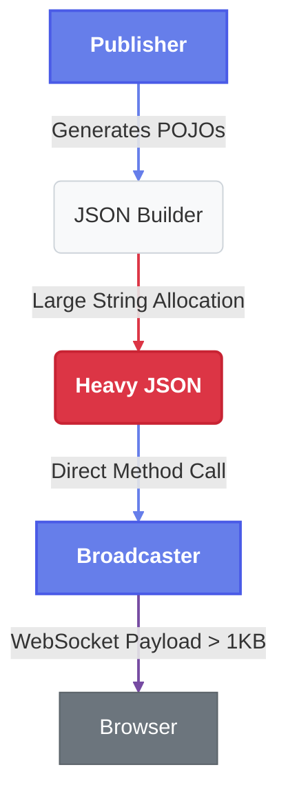
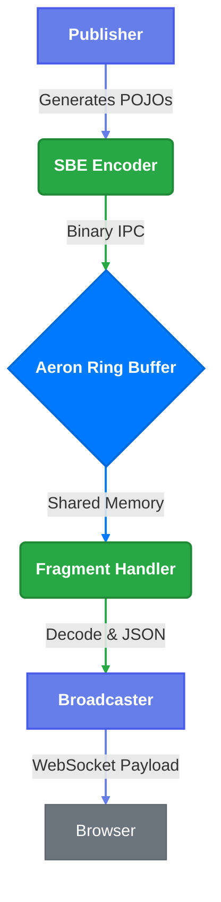

# TradeStreamEE: High-Frequency Trading Reference Architecture

**TradeStreamEE** is a technical demonstration application designed to showcase the "Pauseless Performance" symbiosis between **Payara Server Enterprise** (Jakarta EE) and **Azul Platform Prime** (High-Performance JVM).

It simulates a high-frequency trading (HFT) dashboard that ingests tens of thousands of market data messages per second, processes them in real-time, and broadcasts updates to a web frontend—all without the latency spikes ("jitter") associated with standard Java Garbage Collection.


## ⚡ The Core Technologies

TradeStreamEE gets its speed by removing the middleman. We swapped out heavy, traditional methods (REST/JSON) for 'Mechanical Sympathy', an approach that respects the underlying hardware to squeeze out maximum efficiency.

### 1\. What is Binary Encoding?

Computers do not natively understand text; they understand bits.

* **Text Encoding (JSON/XML):** Easy for humans (`{"price": 100}`), but expensive for computers. The CPU must parse every character, handle whitespace, and convert strings to numbers. This burns CPU cycles and creates massive amounts of temporary memory "garbage."
* **Binary Encoding:** Stores data exactly as the machine represents it in memory (e.g., `100` is stored as 4 raw bytes). No parsing is required. This results in **deterministic latency** and significantly reduced CPU usage.

### 2\. Aeron (The Transport)

[Aeron](https://aeron.io/) is a peer-to-peer, broker-less transport protocol designed for **ultra-low latency** applications.

* **Broker-Less:** There is no central server "middleman." The Publisher sends data directly to the Subscriber's memory address.
* **IPC (Inter-Process Communication):** When components run on the same machine (like in this demo), Aeron bypasses the network stack entirely, writing data directly to shared memory (RAM).

### 3\. SBE (Simple Binary Encoding)

[SBE](https://github.com/real-logic/simple-binary-encoding) is the standard for high-frequency financial trading (FIX SBE). It serves as the **Presentation Layer**, defining how business data (Trades, Quotes) is structured inside the Aeron buffers.

#### **How SBE Works**

Unlike JSON, where you just write data, SBE is **Schema-Driven**. This ensures strict structure and maximum speed.

1.  **Define the Schema (`market-data.xml`):** You define your messages in XML. This acts as the contract between Publisher and Subscriber.
    ```xml
    <sbe:message name="Trade" id="1">
        <field name="price" id="1" type="int64"/>
        <field name="quantity" id="2" type="int64"/>
    </sbe:message>
    ```
2.  **Generate Code:** During the build process (`mvn generate-sources`), the **SbeTool** reads the XML and generates Java classes (Encoders and Decoders).
3.  **Zero-Copy Encoding/Decoding:**
    * **The Flyweight Pattern:** The generated Java classes are "Flyweights." They do not hold data themselves. Instead, they act as a "window" over the raw byte buffer.
    * **No Allocation:** When we read a Trade message, **we do not create a `Trade` object**. We simply move the "window" to the correct position in memory and read the `long` value for price. This generates **zero garbage** for the Garbage Collector to clean up.


## 🚀 The Rationale: Why This Project Exists

Enterprise Java applications often struggle with two competing requirements:

1.  **High Throughput:** Ingesting massive data streams (IoT, Financial Data).
2.  **Low Latency:** Processing that data without "Stop-the-World" pauses.

Standard JVMs (using G1GC or ParallelGC) often "hiccup" under high load, causing UI freezes or missed SLAs. **TradeStreamEE** proves that by combining a modern, broker-less transport (**Aeron**) with a pauseless runtime (**Azul C4**), standard Jakarta EE applications can achieve microsecond-level latency and massive throughput.

### The "A/B" Comparison

This project includes built-in tools to benchmark "The Old Way" vs. "The New Way":

* **Scenario A (Baseline):** Standard OpenJDK + Naive String Processing.
* **Scenario B (Optimized):** Azul Platform Prime + Aeron IPC + Zero-Copy SBE.


## 🏗️ Technical Architecture

The application implements a **Hybrid Architecture**:

1.  **Ingestion Layer (Broker-less):**
    * Uses **Aeron IPC** (Inter-Process Communication) via an Embedded Media Driver.
    * Bypasses the network stack for ultra-low latency between components.
2.  **Serialization Layer (Zero-Copy):**
    * Uses **Simple Binary Encoding (SBE)**.
    * Decodes messages directly from memory buffers (Flyweight pattern) without allocating Java Objects, reducing GC pressure.
3.  **Application Layer (Jakarta EE 11):**
    * **Payara Micro 7** serves as the container.
    * **CDI** manages the lifecycle of the Aeron Publisher and Subscriber.
    * **WebSockets** push updates to the browser.
4.  **Runtime Layer:**
    * **Azul Platform Prime** uses the **C4 Collector** to clean up the "garbage" created by the WebSocket layer concurrently, ensuring a flat latency profile.


## 🛠️ Tech Stack

| Component      | Technology                              | Role                                    |
|:---------------|:----------------------------------------|:----------------------------------------|
| **Runtime**    | **Azul Platform Prime** (Zulu Prime 21) | The Pauseless JVM engine.               |
| **App Server** | **Payara Micro 7** (Jakarta EE 11)      | Cloud-native Jakarta EE runtime.        |
| **Transport**  | **Aeron**                               | Low-latency, high-throughput messaging. |
| **Encoding**   | **SBE (Simple Binary Encoding)**        | Binary serialization (FIX standard).    |
| **Frontend**   | **HTML5 / Chart.js**                    | Real-time visualization via WebSockets. |
| **Build**      | **Docker / Maven**                      | Containerized deployment.               |


## 🔍 Understanding the Modes

This demo allows you to switch between two distinct ingestion pipelines to visualize the impact of architectural choices on JVM performance.

### 1\. DIRECT Mode (The "Heavy" Path)

**Goal:** Simulate a standard, naive enterprise application with high object allocation rates.
**Runtime:** Standard OpenJDK (Eclipse Temurin 21) with G1GC.

**Data Flow:**



1.  **Publisher:** Generates synthetic market data as standard Java Objects.
2.  **Allocation:** Immediately converts data to a JSON `String` using `StringBuilder` (high allocation).
3.  **Artificial Load:** Wraps the JSON in a large "envelope" with 1KB of padding to stress the Garbage Collector.
4.  **Transport:** Direct method call to `MarketDataBroadcaster`.
5.  **WebSocket:** Pushes the heavy JSON string to the browser.
6.  **Browser:** Unwraps the payload and renders the chart.

**Performance Characteristics:**

* **High Allocation Rate:** Gigabytes of temporary String objects created per second.
* **GC Pressure:** Frequent "Stop-the-World" pauses from G1GC lead to "jitter" in the UI charts.

### 2\. AERON Mode (The "Optimized" Path)

**Goal:** Simulate a low-latency financial pipeline using off-heap memory and zero-copy semantics.
**Runtime:** Azul Platform Prime (Zulu Prime 21) with C4 Pauseless GC.

**Data Flow:**



1.  **Publisher:** Generates synthetic market data.
2.  **Encoding:** Encodes data into a compact binary format using **SBE**.
    * *Zero-Copy:* Writes directly to an off-heap direct buffer.
3.  **Transport (Aeron):** Publishes the binary message to the **Aeron IPC** ring buffer.
    * *Kernel Bypass:* Data moves via shared memory, avoiding the OS network stack.
4.  **Subscriber (Fragment Handler):** Reads the binary message using SBE "Flyweights" (reusable view objects).
    * *Zero-Allocation:* No new Java objects are created during decoding.
5.  **Transformation:** Converts the binary data to a compact, flat JSON string (minimal allocation).
6.  **WebSocket:** Pushes the lightweight JSON to the browser.

**Performance Characteristics:**

* **Low Allocation:** Almost no garbage generated in the ingestion hot-path.
* **Pauseless:** Azul C4 collector handles the WebSocket strings concurrently, maintaining a flat latency profile.
* **High Throughput:** Aeron IPC handles millions of messages/sec with sub-microsecond latency.


## 🚦 Quick Start: The Comparison Matrix

The `start.sh` script provides commands to run the TradeStreamEE application in various configurations, allowing for a comprehensive comparison of JVM and architectural performance.

| Scenario                        | Command                      | JVM                 | Ingestion Architecture | Goal                                                                  |
|:--------------------------------|:-----------------------------|:--------------------|:-----------------------|:----------------------------------------------------------------------|
| **1. Modern Stack**             | `./start.sh azul-aeron`      | Azul Prime (C4)     | Aeron (Optimized)      | Demonstrate peak performance: Pauseless GC + Zero-Copy Transport.     |
| **2. Legacy Baseline**          | `./start.sh standard-direct` | Standard JDK (G1GC) | Direct (Heavy)         | Establish the baseline: High allocation on G1GC. Expect jitter.       |
| **3. Fixing Legacy Code**       | `./start.sh azul-direct`     | Azul Prime (C4)     | Direct (Heavy)         | Show how C4 can stabilize a high-allocation app without code changes. |
| **4. Optimizing Standard Java** | `./start.sh standard-aeron`  | Standard JDK (G1GC) | Aeron (Optimized)      | See if architectural optimization helps G1GC performance.             |

### Utilities
*   `./start.sh logs` - View live logs
*   `./start.sh stop` - Stop containers
*   `./start.sh clean` - Deep clean (remove volumes/images)


## ⚙️ Configuration & Tuning

You can tweak the performance characteristics via `docker-compose.yml` or the `.env` file (if created).

### Ingestion Modes (`TRADER_INGESTION_MODE`)

Controls how data moves from the Publisher to the Processor.

* `AERON` (Default): Uses the high-speed binary ring buffer.
* `DIRECT`: Bypasses Aeron; generates Strings directly in the Publisher loop. Useful for isolating Transport vs. GC overhead.

### JVM Tuning (Azul Prime)

The `Dockerfile` is pre-configured with best practices for the C4 collector:

```dockerfile
ENV JAVA_OPTS="-Xms2g -Xmx2g -XX:+AlwaysPreTouch -Djava.net.preferIPv4Stack=true"
```

* **Note:** We purposefully **do not** use `-XX:+UseZGC` in the optimized image, as C4 is the native collector for Azul Prime.


## 📊 Monitoring & Metrics

The application exposes a lightweight REST endpoint for health checks and internal metrics.

**Check Status:**

```bash
./start.sh status
```

**Sample Output:**

```json
{
  "application": "TradeStreamEE",
  "subscriber": "Channel: aeron:ipc, Stream: 1001, Running: true",
  "publisher": { "messagesPublished": 1543021 },
  "runtime": {
    "gcType": "GPGC",
    "freeMemory": "1450 MB"
  }
}
```


## 📂 Project Structure

```text
src/main/
├── java/fish/payara/trader/
│   ├── aeron/          # Aeron Publisher, Subscriber, FragmentHandler
│   ├── sbe/            # Generated SBE Codecs (Flyweights)
│   ├── websocket/      # Jakarta WebSocket Endpoint
│   └── rest/           # Status Resource
├── resources/sbe/
│   └── market-data.xml # SBE Schema Definition
└── webapp/
    └── index.html      # Dashboard UI (Chart.js + WebSocket)
```

## 📜 License

This project is a reference implementation provided for demonstration purposes.