# TradeStreamEE: High-Frequency Trading Reference Architecture

**TradeStreamEE** demonstrates how Jakarta EE applications can achieve low-latency, high-throughput performance by combining modern messaging (Aeron), efficient serialization (SBE), and a concurrent garbage collector (Azul C4).

It simulates a high-frequency trading dashboard that ingests tens of thousands of market data messages per second, processes them in real-time, and broadcasts updates to a web frontend—without the latency spikes associated with traditional Java garbage collection.

## ⚡ The Core Technologies

TradeStreamEE achieves high performance by combining four key technologies:

### Aeron (Transport)

Ultra-low latency messaging that bypasses the network stack when components run on the same machine. Data moves directly through shared memory instead of through kernel networking.

### SBE (Serialization)

Simple Binary Encoding - the financial industry standard for high-frequency trading. Encodes data as compact binary rather than human-readable text, eliminating parsing overhead and reducing memory allocation.

### Payara Micro (Jakarta EE Runtime)

A cloud-native Jakarta EE 11 application server that provides Jakarta CDI for dependency injection, Jakarta WebSocket for real-time browser communication, and Jakarta REST for REST endpoints. Lightweight (~100MB) and fast-starting.

### Azul Platform Prime (Runtime)

A JVM with the C4 garbage collector that performs cleanup concurrently with application execution, avoiding the "stop-the-world" pauses that cause latency spikes in traditional JVMs.

**How they work together:** Payara Micro manages the Aeron publisher/subscriber lifecycle via CDI. The publisher encodes market data into binary using SBE, sends it through Aeron's shared memory transport, and the subscriber decodes it without allocating Java objects. This minimal garbage generation lets C4's concurrent collection easily handle the cleanup, maintaining flat latency even at high throughput.

## 🚀 The Rationale: Why This Project Exists

Enterprise Java applications often struggle with two competing requirements:

1. **High Throughput:** Ingesting massive data streams (IoT, Financial Data).
2. **Low Latency:** Processing that data without "Stop-the-World" pauses.

Standard JVMs (using G1GC or ParallelGC) often "hiccup" under high load, causing UI freezes or missed SLAs. **TradeStreamEE** proves that by combining a modern, broker-less transport (**Aeron**) with a pauseless runtime (**Azul C4**), standard Jakarta EE applications can achieve microsecond-level latency and massive throughput.

### The "A/B" Comparison

This project enables side-by-side JVM comparison with identical architectural choices:

* **Both clusters** use **AERON IPC + Zero-Copy SBE** by default (optimized architecture)
* **Both clusters** can optionally run **DIRECT mode** (naive string processing) via `TRADER_INGESTION_MODE` flag
* **The key difference** is the JVM: Azul C4 (pauseless) vs Standard G1GC (stop-the-world)

This isolates the GC as the variable, letting you see how the same application behaves under different garbage collectors.

## 🚦 Quick Start

### Primary Use Case: Side-by-Side JVM Comparison

**Why this matters:** Most benchmarking tools run tests serially, start JVM A, test, shut down, start JVM B, test, then manually compare spreadsheets. That's not how real systems behave.

TradeStreamEE deploys both JVMs simultaneously, enabling you to see real-time behavior differences under identical conditions.

**The key point:** Both clusters run the **exact same WAR file**, same code, same configuration, same workload. The **only difference** is the JVM. This isolates the garbage collector as the sole variable, making the comparison fair and meaningful.

```bash
./start-comparison.sh all
```

**What this does:**

1. Builds and deploys **Azul C4 cluster** (3 instances, ports 8080-8083)
2. Builds and deploys **G1GC cluster** (3 instances, ports 9080-9083)
3. Starts **Prometheus** for metrics collection
4. Starts **Grafana** with pre-configured JVM comparison dashboards
5. Starts **Loki/Promtail** for centralized logging

**Then open both URLs in separate browser tabs:**

- **C4 Cluster:** http://localhost:8080/trader-stream-ee/
- **G1 Cluster:** http://localhost:9080/trader-stream-ee/

**Watch the "GC Pause Time (Live)" chart** to see the difference:

| Metric                   | Azul C4            | G1GC              | What You'll See                                                   |
|:-------------------------|:-------------------|:------------------|:------------------------------------------------------------------|
| **GC Pause Time (Live)** | Flatline           | Spikes            | C4 maintains consistent latency; G1GC shows stop-the-world pauses |
| **Heap Usage**           | Smooth oscillation | Sawtooth patterns | Different collection strategies visualized in real-time           |
| **Under Load**           | Barely moves       | Jitter increases  | Apply stress via UI and watch the gap widen                       |

**Other options:**

- `./start-comparison.sh` - Clusters only, no monitoring stack (faster for rapid development)
- `./stop-comparison.sh` - Stop all comparison services

---

### Single-JVM Testing (start.sh)

Use `./start.sh` for testing individual configurations or architectural modes. This runs ONE JVM at a time for focused testing.

| Scenario                 | Command                      | JVM                 | Architecture      | Purpose                                                          |
|:-------------------------|:-----------------------------|:--------------------|:------------------|:-----------------------------------------------------------------|
| Modern Stack             | `./start.sh azul-aeron`      | Azul Prime (C4)     | Aeron (Optimized) | Peak performance with pauseless GC + zero-copy transport         |
| Legacy Baseline          | `./start.sh standard-direct` | Standard JDK (G1GC) | Direct (Heavy)    | Baseline: high allocation on G1GC, expect jitter                 |
| Fixing Legacy Code       | `./start.sh azul-direct`     | Azul Prime (C4)     | Direct (Heavy)    | Show how C4 stabilizes high-allocation apps without code changes |
| Optimizing Standard Java | `./start.sh standard-aeron`  | Standard JDK (G1GC) | Aeron (Optimized) | Test if architectural optimization helps G1GC performance        |

**Utilities:**

- `./start.sh logs` - View live logs
- `./start.sh stop` - Stop containers
- `./start.sh clean` - Deep clean (remove volumes/images)

## 🏗️ Technical Architecture

The application implements a **Hybrid Architecture**:

1. **Ingestion Layer (Broker-less):**
   * Uses **Aeron IPC** (Inter-Process Communication) via an Embedded Media Driver.
   * Bypasses the network stack for ultra-low latency between components.
2. **Serialization Layer (Zero-Copy):**
   * Uses **Simple Binary Encoding (SBE)**.
   * Decodes messages directly from memory buffers (Flyweight pattern) without allocating Java Objects, reducing GC pressure.
3. **Application Layer (Jakarta EE 11):**
   * **Payara Micro 7** serves as the container.
   * **CDI** manages the lifecycle of the Aeron Publisher and Subscriber.
   * **WebSockets** push updates to the browser.
4. **Runtime Layer:**
   * **Azul Platform Prime** uses the **C4 Collector** to clean up the "garbage" created by the WebSocket layer concurrently, ensuring a flat latency profile.

## 🛠️ Tech Stack

| Component      | Technology                              | Role                                    |
|:---------------|:----------------------------------------|:----------------------------------------|
| **Runtime**    | **Azul Platform Prime** (Zulu Prime 21) | The Pauseless JVM engine.               |
| **App Server** | **Payara Micro 7** (Jakarta EE 11)      | Cloud-native Jakarta EE runtime.        |
| **Transport**  | **Aeron**                               | Low-latency, high-throughput messaging. |
| **Encoding**   | **SBE (Simple Binary Encoding)**        | Binary serialization (FIX standard).    |
| **Frontend**   | **HTML5 / Chart.js**                    | Real-time visualization via WebSockets. |
| **Build**      | **Docker / Maven**                      | Containerized deployment.               |

## 🔍 Understanding the Modes

This demo supports two ingestion architectures that you can use with **either JVM**. Set the `TRADER_INGESTION_MODE` environment variable (`AERON` or `DIRECT`) to switch between them.

**Important:** Both Azul C4 and G1GC clusters can run either mode. This lets you test whether architectural optimization (AERON) helps G1GC performance, or how C4 handles high-allocation legacy code (DIRECT).

```mermaid
graph TD
    subgraph DIRECT["DIRECT Mode (High Allocation)"]
        D1[Publisher] --> D2["JSON + 1KB padding"]
        D2 --> D3[Broadcaster]
        D3 --> D4["WebSocket → Browser"]
    end

    subgraph AERON["AERON Mode (Zero-Copy, Default)"]
        A1[Publisher] --> A2["SBE Binary"]
        A2 --> A3["Aeron IPC"]
        A3 --> A4["Fragment Handler"]
        A4 --> A5[Broadcaster]
        A5 --> A6["WebSocket → Browser"]
    end

    classDef heavy fill:#dc3545,stroke:#c82333,stroke-width:2px,color:#fff
    classDef optimized fill:#28a745,stroke:#218838,stroke-width:2px,color:#fff

    class D1,D2,D3,D4 heavy
    class A1,A2,A3,A4,A5,A6 optimized
```



### 1\. DIRECT Mode (The "Heavy" Path)

**Goal:** Simulate a standard, naive enterprise application with high object allocation rates.
**Use for:** Stress-testing GC behavior under high allocation pressure.

**How it works:**

1. **Publisher** generates synthetic market data as POJOs
2. **Allocation** converts data to JSON `String` using `StringBuilder` (high allocation)
3. **Artificial Load** wraps JSON in 1KB padding to stress the Garbage Collector
4. **Transport** via direct method call to `MarketDataBroadcaster`
5. **WebSocket** pushes heavy JSON to browser

**Performance Characteristics:**

- **High Allocation:** Gigabytes of temporary String objects per second
- **GC Pressure:** Frequent pauses on G1GC; C4 handles it better but still creates work

### 2\. AERON Mode (The "Optimized" Path, Default)

**Goal:** Low-latency financial pipeline using off-heap memory and zero-copy semantics.
**Use for:** Production-grade performance with minimal GC impact.

**How it works:**

1. **Publisher** generates synthetic market data
2. **SBE Encoder** writes binary format to off-heap direct buffer (zero-copy)
3. **Aeron IPC** publishes to shared memory ring buffer (kernel bypass)
4. **Fragment Handler** reads using SBE "Flyweights" (reusable views, no allocation)
5. **Transformation** converts to compact JSON for WebSocket
6. **WebSocket** pushes lightweight JSON to browser

**Performance Characteristics:**

- **Low Allocation:** Almost no garbage in the ingestion hot-path
- **High Throughput:** Aeron IPC handles millions of messages/sec with sub-microsecond latency
- **Both JVMs benefit** from reduced allocation, but C4 maintains flat latency profile

## ⚙️ Configuration & Tuning

You can tweak the performance characteristics via `docker-compose.yml` or the `.env` file (if created).

### Ingestion Modes (`TRADER_INGESTION_MODE`)

Controls how data moves from the Publisher to the Processor.

* `AERON` (Default): Uses the high-speed binary ring buffer.
* `DIRECT`: Bypasses Aeron; generates Strings directly in the Publisher loop. Useful for isolating Transport vs. GC overhead.

### JVM Tuning & Configuration

Heap size varies by deployment type:

| Deployment                            | Dockerfiles                                     | Heap Size | Reason                                                  |
|:--------------------------------------|:------------------------------------------------|:----------|:--------------------------------------------------------|
| **Single Instance** (`start.sh`)      | `Dockerfile`, `Dockerfile.standard`             | 8GB       | Full heap for maximum throughput                        |
| **Clustered** (`start-comparison.sh`) | `Dockerfile.scale`, `Dockerfile.scale.standard` | 4GB       | Balanced for 3-instance deployments (~12GB per cluster) |

**Common JVM options:**

```dockerfile
# Azul Prime (C4) - 8GB single instance example
ENV JAVA_OPTS="-Xms8g -Xmx8g -XX:+AlwaysPreTouch -XX:+UseTransparentHugePages -Djava.net.preferIPv4Stack=true"

# Standard JDK (G1GC) - 4GB cluster example
ENV JAVA_OPTS="-Xms4g -Xmx4g -XX:+UseG1GC -XX:+AlwaysPreTouch -XX:+UseTransparentHugePages -Djava.net.preferIPv4Stack=true"
```

**Infrastructure improvements:**

- **Pre-touch Memory** (`-XX:+AlwaysPreTouch`): Pre-allocates heap pages to eliminate runtime allocation overhead
- **Transparent Huge Pages** (`-XX:+UseTransparentHugePages`): Reduces TLB misses for large memory operations
- **GC Logging**: Detailed event logging with decorators for analysis
- **Rate-Limited Logging**: Prevents log flooding during high-throughput operations

**Note:** Azul Platform Prime uses C4 by default; we don't specify `-XX:+UseZGC` since C4 is the native, optimized collector for Azul Prime.

### GC Monitoring & Stress Testing

The application includes comprehensive GC monitoring and memory pressure testing capabilities to demonstrate JVM performance differences:

#### GC Statistics Collection

**GCStatsService** collects real-time garbage collection metrics via JMX MXBeans:

* **Collection Metrics**: Total collection count and time for each GC type
* **Pause Time Analysis**: Individual pause durations with percentile calculations (P50, P95, P99, P99.9, Max)
* **Memory Usage**: Heap memory utilization (total, used, free)
* **Recent Pause History**: Last 100 pause times for trend analysis

#### Memory Pressure Testing

**MemoryPressureService** provides controlled memory allocation to stress test GC performance:

**Allocation Modes:**

* **OFF**: No additional allocation
* **LOW**: 1 MB/sec - Light pressure
* **MEDIUM**: 10 MB/sec - Moderate pressure
* **HIGH**: 500 MB/sec - Heavy pressure
* **EXTREME**: 2 GB/sec - Extreme pressure

Each mode allocates byte arrays in a background thread to create realistic memory pressure, allowing observation of:

* C4's concurrent collection vs G1GC's "stop-the-world" pauses
* Latency impact under increasing memory pressure
* Throughput degradation patterns

#### GC Challenge Mode

The web UI includes **GC Challenge Mode** controls that allow:

* Real-time switching between allocation modes
* Visual feedback showing current stress level
* Side-by-side pause time visualization
* Immediate observation of collector behavior under load

This feature enables live demonstration of how Azul C4 maintains low pause times even under extreme memory pressure, while G1GC shows increasingly long pauses.

## 📊 Monitoring & Observability

When running `./start-comparison.sh all`, the following monitoring stack is deployed:

| Component             | Access                              | Purpose                       |
|:----------------------|:------------------------------------|:------------------------------|
| **Grafana Dashboard** | http://localhost:3000 (admin/admin) | JVM comparison dashboards     |
| **Prometheus**        | http://localhost:9090               | Metrics collection            |
| **Loki**              | http://localhost:3100               | Log aggregation               |
| **C4 Application**    | http://localhost:8080 (Traefik LB)  | Azul C4 cluster (3 instances) |
| **G1 Application**    | http://localhost:9080 (Traefik LB)  | G1GC cluster (3 instances)    |

**Direct instance access:**

- C4 instances: http://localhost:8081, http://localhost:8082, http://localhost:8083
- G1 instances: http://localhost:9081, http://localhost:9082, http://localhost:9083

### Stress Testing

Use the UI or API to apply memory pressure and observe GC behavior differences:

```bash
# Apply extreme memory pressure via API
curl -X POST http://localhost:8080/api/pressure/mode/EXTREME    # C4 cluster
curl -X POST http://localhost:9080/api/pressure/mode/EXTREME    # G1GC cluster

# Get current GC statistics
curl http://localhost:8080/api/gc/stats
curl http://localhost:9080/api/gc/stats

# Available modes: OFF, LOW, MEDIUM, HIGH, EXTREME
# Allocation rates: 0 MB/s, 1 MB/s, 10 MB/s, 500 MB/s, 2 GB/s
```

## 📂 Project Structure

```text
src/main/
├── java/fish/payara/trader/
│   ├── aeron/          # Aeron Publisher, Subscriber, FragmentHandler
│   ├── sbe/            # Generated SBE Codecs (Flyweights)
│   ├── websocket/      # Jakarta WebSocket Endpoint
│   ├── rest/           # Status, GC Stats, and Memory Pressure Resources
│   ├── gc/             # GC statistics collection and monitoring
│   ├── pressure/       # Memory pressure testing services
│   └── monitoring/     # GC monitoring services (GCPauseMonitor, MemoryPressure)
├── resources/sbe/
│   └── market-data.xml # SBE Schema Definition
└── webapp/
    └── index.html      # Dashboard UI (Chart.js + WebSocket)

monitoring/
├── grafana/
│   ├── provisioning/   # Grafana datasources and dashboard configs
│   └── dashboards/     # Pre-configured JVM comparison dashboard
├── jmx-exporter/       # JMX exporter configuration and JAR
├── prometheus/         # Prometheus configuration
├── loki/              # Loki log aggregation config
└── promtail/          # Promtail log shipping config

start-comparison.sh           # Automated deployment script for JVM comparison
stop-comparison.sh            # Stop script for comparison services
docker-compose-c4.yml          # Azul Prime C4 cluster setup
docker-compose-g1.yml          # Eclipse Temurin G1GC cluster setup
docker-compose-monitoring.yml  # Monitoring stack (Prometheus, Grafana, Loki)
Dockerfile.scale               # Multi-stage build for C4 instances
Dockerfile.scale.standard      # Build for G1GC instances
```

## 🧪 Testing & Quality Assurance

### Quick Test Execution

```bash
# Quick test (unit tests only, ~30 seconds)
./test.sh quick

# Full test suite (unit + integration, 2-5 minutes)
./test.sh full

# Maven commands
./mvnw test                    # Unit tests
./mvnw jacoco:report          # Generate coverage report
```

### Current Test Coverage

**✅ Working Tests (160/160 passing):**

- **Monitoring & GC**: Full coverage of SLA monitoring logic and GC notification handling.
- **REST Resources**: Comprehensive tests for Memory Pressure and GC Stats endpoints.
- **Core Logic**: Validated `AllocationMode` and concurrency configurations.
- **WebSockets**: Verified `MarketDataBroadcaster` functionality and session management.

**📊 Coverage Metrics:**

- **Tests**: 160 unit tests with 100% pass rate
- **Monitoring Coverage**: >90% (SLAMonitor, GCStatsService)
- **REST API Coverage**: >85% (Resources and DTOs)
- **Instruction Coverage**: High coverage for business logic; integration logic relies on `test.sh`.

### Test Categories

1. **Unit Tests**: Core component testing in isolation (`src/test/java`)
2. **Integration Tests**: Service layer interactions and resource validation
3. **Performance Tests**: Load testing and benchmarks via scripts
4. **Memory Pressure Tests**: GC behavior validation and stress scenarios

## 📜 License

This project is a reference implementation provided for demonstration purposes.
