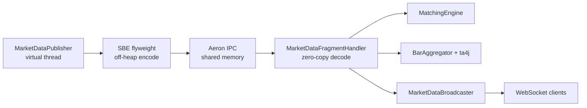
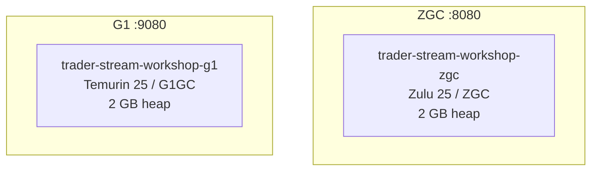
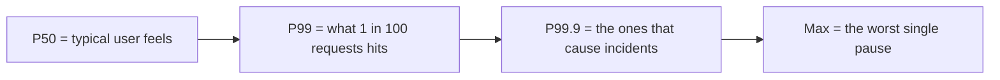
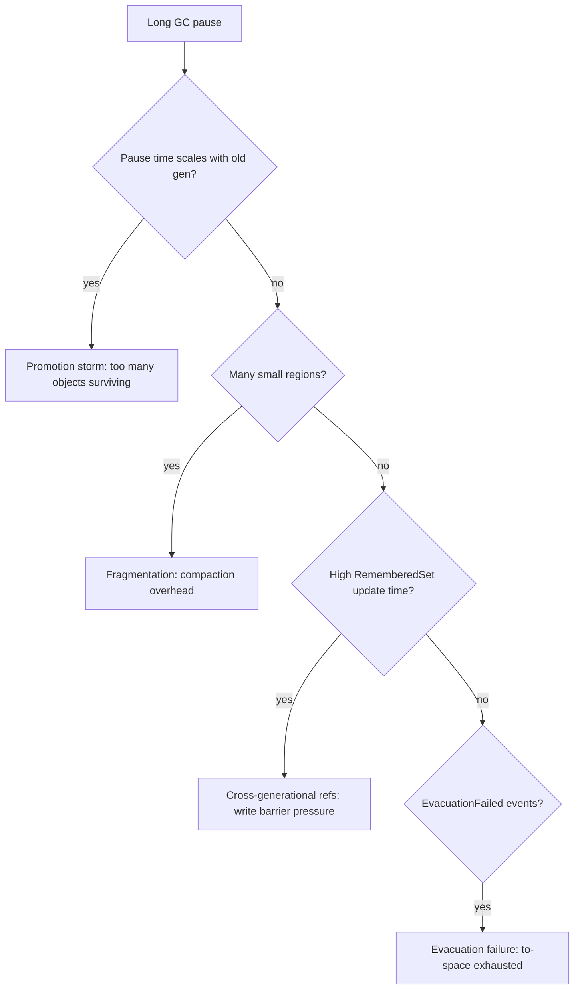
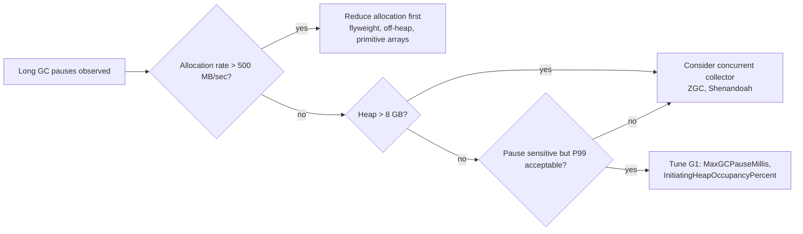

# Low-Latency Trading with Jakarta EE and Payara Micro

## Build, observe, and stress-test a real trading system with JFR · JNation hands-on workshop

Total time: 3 hours 30 minutes, broken into five modules. Each module ends with a hands-on exercise and a discussion checkpoint. You will leave with the application source, a generation script for the recordings, a printable analysis checklist, and reusable JFR event templates.

### What you will learn

By the end of this workshop you will be able to:

1. Identify the dominant cause of a GC pause from a JFR recording in under five minutes.
2. Distinguish young, mixed, and full collections by their JFR signatures.
3. Recognise the four common pathologies: promotion storms, fragmentation, remembered-set overhead, and evacuation failure.
4. Add custom `@Name`-annotated JFR events to correlate application behaviour with runtime events.
5. Compare two collectors objectively under identical workloads.

### Audience

Senior Java developers comfortable with Jakarta EE, virtual threads, and idiomatic Java 21. No prior JFR or HFT experience required. Bring a laptop with Docker, Git, and JDK Mission Control installed; see [README.md](./README.md) for setup details.

### For the speaker

Before running this workshop in front of a room, read [speaker-prep.md](./speaker-prep.md) and [operational-notes.md](./operational-notes.md). The speaker-prep file has the day-of checklist; operational-notes has the risk matrix and the live diagnostic checklist for when something misbehaves.


## Architecture you will be running



The default workshop setup (`docker-compose-workshop.yml`) runs two single-instance Payara Micro containers, one per collector, each with 2 GB heap:



Each instance forms its own single-node Hazelcast cluster. Heap size, `AlwaysPreTouch`, and transparent huge pages are identical on both sides. The only deliberate difference is the garbage collector.

For a more powerful host (16+ GB RAM), you can run the full 3+3 side-by-side cluster with monitoring via `docker-compose-scale.yml` (ZGC) and `docker-compose-scale-standard.yml` (G1).


## Pre-workshop setup

Run this on your laptop before the session. Allow 20 minutes the first time.

```bash
git clone <repo-url>
cd trader-stream-ee
git checkout jnation-workshop
# quickstart.sh runs verify-setup, builds, starts, waits for healthy, and
# fires a 15-second smoke recording so you know the pipeline works.
./workshop/scripts/quickstart.sh

# What quickstart does, step by step (useful if you prefer to run it manually):
./workshop/scripts/verify-setup.sh
docker compose -f docker-compose-workshop.yml up -d --build

# For the full 3+3 comparison stack (needs a beefy host):
# docker compose -f docker-compose-scale.yml -f docker-compose-scale-standard.yml up -d
```

You should end up with:

|                    URL                    |              Purpose               |
|-------------------------------------------|------------------------------------|
| `http://localhost:8080/trader-stream-ee/` | ZGC instance (Zulu 25)            |
| `http://localhost:9080/trader-stream-ee/` | G1 instance (Temurin 25)          |

JDK Mission Control installation:

- Azul Mission Control (free): <https://www.azul.com/products/components/azul-mission-control/>
- OpenJDK JMC build: <https://github.com/openjdk/jmc>
- 

## Module 1: Setup and warm-up (30 min)

**Goal:** Get every attendee from clone to "I can open a real JFR recording in JMC" within 30 minutes.

### 1.1 Verify the clusters (5 min)

```bash
curl -s http://localhost:8080/trader-stream-ee/api/health/check | jq
curl -s http://localhost:9080/trader-stream-ee/api/health/check | jq
```

Both must return `"status": "healthy"`. If one is unhealthy, give it another 30 seconds; Payara Micro's deploy completes asynchronously.

### 1.2 Generate a baseline recording (10 min)

The application exposes a JFR REST API. We will start a 60-second recording while the publisher runs in steady mode.

```bash
# ZGC baseline
curl -X POST 'http://localhost:8080/trader-stream-ee/api/jfr/recording/start?name=baseline&durationSeconds=60&settings=tradestream-workshop'

# G1 baseline
curl -X POST 'http://localhost:9080/trader-stream-ee/api/jfr/recording/start?name=baseline&durationSeconds=60&settings=tradestream-workshop'
```

The recording auto-stops after 60 seconds and dumps to disk. Find it:

```bash
ls -lh monitoring/recordings/workshop-zgc/
ls -lh monitoring/recordings/workshop-g1/
```

### 1.3 Open in JMC (10 min)

```bash
jmc -open monitoring/recordings/workshop-zgc/baseline-*.jfr
```

In JMC, find these views (exact path varies between OpenJDK JMC and Azul Mission Control; the view names are the same):

1. **Garbage Collections** (under General or JVM Internals): the headline pause times.
2. **Memory → Allocation**: per-thread allocation rates.
3. **Threads**: find `market-data-publisher` (the virtual thread driving the Aeron burst loop).

### 1.4 Exercise: find the longest GC pause

Find the longest GC pause in your baseline recording. Note:

- Its duration in milliseconds.
- The collector that produced it (`G1 Young Generation`, `ZGC`, etc.).
- The cause field (`G1 Evacuation Pause`, `Allocation Failure`, etc.).

Hint: in JMC, find the **Garbage Collections** view and sort by `Longest Pause` descending. The duration column sorts in place. See [exercises/module-1-find-longest-pause/](./exercises/module-1-find-longest-pause/README.md) for hints and the expected output.

### Module 1 discussion checkpoint

Compare findings across the room. The ZGC baseline should show pauses under 1 ms; the G1 baseline should show occasional young-gen pauses around 5-15 ms even under steady allocation. The interesting question is *why the difference exists at idle*, not just under stress.


## Module 2: Reading JFR recordings (60 min)

**Goal:** Build the mental model that lets you triage a JFR recording in five minutes.

### 2.1 GC events: what to read first (15 min)

JFR records dozens of GC event types. For pause analysis, three matter most:

|                      Event                      |                                        What it tells you                                        |
|-------------------------------------------------|-------------------------------------------------------------------------------------------------|
| `jdk.GarbageCollection`                         | Wall-clock pause time, cause, sum of phases. The headline.                                      |
| `jdk.GCPhasePause`                              | Per-phase pause breakdown (mark, evacuate, ref-processing, etc.). Where the time actually went. |
| `jdk.GCPhaseParallel` / `jdk.GCPhaseConcurrent` | Subphase work, useful for distinguishing root scanning from object copy.                        |

For G1 specifically: `jdk.G1HeapSummary`, `jdk.G1HeapRegionInformation`, `jdk.EvacuationInformation`, `jdk.EvacuationFailed`, `jdk.PromotionFailed`.

### 2.2 Pause time distributions (10 min)

Average pause time lies. Distributions tell the truth.



In JMC, find the **Garbage Collections** view and look at the Pause Time histogram. Sort by duration descending. The first row is your Max. P99 lives roughly at the 99th-percentile mark of the cumulative distribution.

A 5-second recording at 60K msg/sec produces approximately 100 young collections under steady allocation. P99 over that sample size is barely meaningful. Workshop recordings are 60 seconds long for that reason, and even then your statistical confidence is limited; in production, recordings should be hours long for stable percentiles.

### 2.3 Young versus mixed versus full (10 min)

The **Collector Name** column tells you which GC algorithm ran. This workshop uses two of the four main collectors available in OpenJDK:

| Collector | Source | Strategy | Pause behaviour |
|-----------|--------|----------|-----------------|
| **G1** (Garbage First) | OpenJDK, ships with JDK 9+ | Generational, mostly concurrent. Young collections are STW; old-gen marking is concurrent. | Pauses scale with live set. Typical 5-50 ms. |
| **ZGC** (Z Garbage Collector) | OpenJDK, ships with JDK 11+ (production-ready JDK 15+) | Generational (since JDK 21), fully concurrent. STW phases do only root scanning. | Sub-millisecond regardless of heap size. |
| **Shenandoah** | OpenJDK, ships with JDK 12+ | Concurrent, uses brooks pointers for object movement. | Similar to ZGC: sub-millisecond. |

G1 is the OpenJDK default. ZGC and Shenandoah are the low-latency OpenJDK alternatives. Azul Platform Prime ships C4, a fully concurrent collector with zero STW pauses; it is mentioned in the closing section as the commercial option beyond the OpenJDK envelope.

This workshop compares ZGC (Azul Zulu 25) against G1 (Eclipse Temurin 25). The contrast is the same: concurrent vs STW collection under allocation pressure.

In the Garbage Collections view, filter by **Collector Name** to see each collector's behaviour:

|      Collector Name       |                     What G1 was doing                      |
|---------------------------|------------------------------------------------------------|
| `G1New` (Normal)          | Young-only collection. Cheap.                              |
| `G1Mixed`                 | Young plus some old regions. The expensive case.           |
| `G1Old`                   | Whole-heap, stop-the-world. The "you have a problem" case. |
| `G1ConcurrentMark`        | Mark phases running with the application; not a pause.     |

ZGC will show:

| Collector Name | What ZGC was doing                          |
|----------------|---------------------------------------------|
| `ZGC Minor`    | Concurrent young-gen collection.            |
| `ZGC Major`    | Concurrent full collection.                 |

The **Cause** column tells you what triggered the collection. The common causes you will see:

| Cause                     | Meaning                                                                                                          | Typical collector |
|---------------------------|------------------------------------------------------------------------------------------------------------------|-------------------|
| `Allocation Rate`         | Application allocating fast enough to fill the young generation. This is the normal, healthy cause.              | G1, ZGC           |
| `G1 Evacuation Pause`     | G1 needs to move (evacuate) live objects out of young regions to reclaim space.                                  | G1                |
| `High Usage`              | Heap occupancy crossed a threshold. ZGC initiates a concurrent cycle to bring usage down.                        | ZGC               |
| `G1 Humongous Allocation` | An object larger than half a G1 region was allocated. G1 treats these specially because they waste region space. | G1                |
| `System.gc()`             | Application code (or a library) explicitly requested a GC. Usually unwanted in production.                       | Any               |
| `Metadata GC Threshold`   | Metaspace (loaded classes) filled up. Often caused by dynamic class generation.                                  | Any               |

**How to read `G1 Humongous Allocation`:** G1 divides the heap into fixed-size regions (16 MB in this workshop). Any object larger than half a region (8 MB) is a "humongous" object. G1 cannot move these objects during collection, so they cause fragmentation and force immediate old-gen allocation. In this application, the pressure scenarios generate large arrays that trigger this cause. If you see it frequently, the fix is either smaller allocations or larger G1 regions (`-XX:G1HeapRegionSize`).

### 2.4 The four pathologies (15 min)

GC pauses fall into four categories, each with a distinct JFR signature. These four patterns let you diagnose any GC problem from a recording, regardless of the application.

**Background: how generational GC works.** Both G1 and ZGC divide the heap into generations. New objects are allocated in the young generation. Objects that survive enough collections get *promoted* to the old generation. The collector must track references from old objects pointing to young objects (the *remembered set*). When the collector decides a region is no longer efficient to maintain, it *compacts* it by moving live objects elsewhere and reclaiming the space. These mechanics produce four failure modes:

| Pathology                         | What goes wrong                                                                                                                                      | Layman's analogy                                                                                                                                                     |
|-----------------------------------|------------------------------------------------------------------------------------------------------------------------------------------------------|----------------------------------------------------------------------------------------------------------------------------------------------------------------------|
| **Promotion storm**               | Objects survive young-gen collections faster than the collector can promote them. Old gen fills rapidly.                                             | A conveyor belt dumping packages into a warehouse faster than the forklifts can shelve them.                                                                         |
| **Fragmentation**                 | Many short-lived objects of different sizes leave the heap pitted with small free gaps. No single gap is large enough for a big allocation.          | A parking lot where every space has a motorcycle in it; no room for a delivery truck even though half the lot is "empty."                                            |
| **Cross-generational references** | Old objects hold many references to young objects. The collector must scan these references during every young-gen collection, adding to pause time. | A filing cabinet (old gen) full of sticky notes pointing at documents on your desk (young gen). Every time you clear your desk, you have to check every sticky note. |
| **Evacuation failure**            | The collector tries to move objects out of a region but there is nowhere to put them. The entire heap is too full.                                   | A removals truck shows up but every storage unit in the city is already rented.                                                                                      |

The decision tree for triaging a recording:



For each pathology there is one or two telltale events in JFR. See [analysis-checklist.md](./analysis-checklist.md) for the full triage tree.

### 2.5 Exercise: diagnose EARNINGS_SPIKE (15 min)

> **Pre-recorded files must exist before this module.** Run `./workshop/scripts/record-scenarios.sh` once during setup (about 16 minutes), or have the facilitator pre-generate them. The directory `workshop/recordings/` ships with only a README; the `.jfr` files are produced from your hardware.

Use the pre-recorded files:

```bash
jmc -open workshop/recordings/zgc-earnings-spike.jfr
jmc -open workshop/recordings/g1-earnings-spike.jfr
```

Or generate fresh:

```bash
curl -X POST 'http://localhost:9080/trader-stream-ee/api/jfr/recording/start?name=earnings-live&durationSeconds=75&settings=tradestream-workshop'
sleep 10
curl -X POST 'http://localhost:9080/trader-stream-ee/api/pressure/mode/EARNINGS_SPIKE'
sleep 60
curl -X POST 'http://localhost:9080/trader-stream-ee/api/pressure/mode/OFF'
```

In the G1 recording you should see:

- Young-gen collections becoming more frequent.
- The pause time gradually rising as old gen fills.
- `PromoteObjectOutsidePLAB` events climbing.
- Eventually a mixed collection with a noticeable pause.

In the ZGC recording the same workload should produce no visible pause increase. Use this as the comparison anchor for Module 4. Full hints and expected outputs are in [exercises/module-2-diagnose-earnings-spike/](./exercises/module-2-diagnose-earnings-spike/README.md).

### Module 2 discussion checkpoint

Two questions to debate around the room:

1. If your production app has a P99 pause of 80 ms and a Max of 800 ms, which one do you optimise first, and why?
2. What recording duration would you need for the P99 to be statistically meaningful given 10 collections per minute?


## Module 3: Custom JFR events (45 min)

**Goal:** Add a domain-specific event that correlates application behaviour with GC events.

### 3.1 The shape of a custom event (10 min)

A custom event is a `public class extends jdk.jfr.Event` annotated with `@Name`, `@Label`, `@Category`, and optionally `@StackTrace(false)` for hot paths.

Two examples already in the codebase:

```java
// src/main/java/fish/payara/trader/jfr/MarketDataEvents.java
@Name("trade.published")
@Label("Trade Published")
@StackTrace(false)
public static class TradePublished extends Event {
    public String symbol;
    public long price;
    public int quantity;
    public String side;
}
```

```java
// emit it from MarketDataPublisher.java
TradePublished tradeEvent = new TradePublished();
if (tradeEvent.isEnabled()) {
    tradeEvent.symbol = symbol;
    tradeEvent.price = price;
    tradeEvent.quantity = qty;
    tradeEvent.side = side.name();
    tradeEvent.commit();
}
```

Critical detail: `event.isEnabled()` is the cost gate. When the event is disabled (recording stopped or this event type filtered out), `isEnabled()` returns `false` and the entire body is skipped. The JIT can sometimes eliminate the bare `new TradePublished()` allocation when the type is disabled, but it cannot eliminate any computation you do to compute the field values (string concatenation, lookups, formatting). The `isEnabled()` gate is what guarantees that field-population work runs only when JFR is recording the type.

`@StackTrace(false)` disables stack trace capture per emission. Stack traces are the most expensive part of a JFR event; for events that fire millions of times per second, leave them off.

### 3.2 Where to emit from (5 min)

Three principles for choosing emission points:

1. **One event per logical operation, not per method call.** Don't decorate every function; pick the boundary where the operation succeeded or failed.
2. **Numeric fields are cheap; String fields are not.** Strings get interned in the JFR string pool, but the interning lookup is hot-path overhead. Use enums-as-ints where possible.
3. **Begin/commit pairs measure duration.** Use `event.begin()` and `event.commit()` to capture the elapsed time of an operation automatically; JFR records the start, end, and thread.

### 3.3 Correlating with GC events (10 min)

In JMC, the **Event Browser** lets you overlay timelines. To see whether GC pauses cause SBE encoding stalls:

1. Find `sbe.encode` under the Custom events section.
2. Find `jdk.GCPhasePause` under GC events.
3. Drag both onto the same time axis.

A correlated stall looks like this:

```
GC pause:        [---50ms---]
SBE encode:  ............    .  .  .   .
                ^             ^
                stalls        catches up
```

If your SBE encode count drops to zero during the pause window, the publisher virtual thread is paused. If it does not drop, you have a virtual-thread carrier pinning problem - the publisher is running on a different carrier than the GC pause affected.

### 3.4 Exercise: track burst patterns (20 min)

Add a `BurstPatternEvent` that fires when the publisher detects a 5x rate spike. Starter code is at [`exercises/module-3-burst-event/BurstPatternEvent.starter.java`](./exercises/module-3-burst-event/BurstPatternEvent.starter.java).

The exercise walks through:

1. Define the event class with `@Name("burst.pattern.detected")`.
2. Add fields: `multiplier` (int), `windowMillis` (long), `peakRate` (double).
3. Wire it into `MarketDataPublisher.detectBurstMode()`.
4. Install with `./workshop/scripts/install-exercise.sh module-3-burst-event`.
5. Rebuild, re-record, and verify the event appears in the Event Browser under Custom events.
6. Build a custom JMC dashboard that overlays your event with `gc.sla.violation` and `aeron.backpressure`.

The completed dashboard XML is at [`exercises/module-3-burst-event/jmc-dashboard.xml`](./exercises/module-3-burst-event/jmc-dashboard.xml); import it via JMC's `File → Open → Custom Dashboard`.

### Module 3 discussion checkpoint

What would you instrument in your own application? What is the single hottest code path you currently have no visibility into?


## Module 4: Stress testing and production readiness (45 min)

**Goal:** Stress-test the same Jakarta EE application on two OpenJDK runtimes and read the recordings to decide whether the application is ready to ship. The workshop will not declare a winner; the recordings will say what they say, and you will read them.

### 4.1 The setup is already running (5 min)

Both clusters are healthy. You have already run baseline + EARNINGS_SPIKE on both. The remaining scenarios are:

|             Scenario             |                        What it stresses                         |
|----------------------------------|-----------------------------------------------------------------|
| `INTRADAY_POSITION_GROWTH`       | Mixed collection scaling as the position book grows from 100 MB to 2 GB. |
| `MULTI_VENUE_QUOTE_CHURN`        | Compaction overhead under short-lived multi-venue quote churn.  |
| `LONG_HORIZON_POSITION_BOOK`     | Write-barrier and remembered-set maintenance.                   |

For each scenario, the application's `MemoryPressureService` produces the exact allocation pattern; you don't need to write any code.

### 4.2 Generate (or use pre-recorded) (10 min)

Pre-recorded files are in `workshop/recordings/`. To save time, work from those. To produce fresh recordings:

```bash
./workshop/scripts/record-scenarios.sh
```

This takes about 7 minutes and produces all 10 .jfr files (2-3 MB each).

### 4.3 Side-by-side analysis (20 min)

Open paired recordings in JMC:

```bash
jmc -open workshop/recordings/zgc-multi-venue-quote-churn.jfr -open workshop/recordings/g1-multi-venue-quote-churn.jfr
```

For each pair, fill in this comparison table (template at [exercises/module-4-stress-testing/comparison-template.md](./exercises/module-4-stress-testing/comparison-template.md)):

|            Metric             | ZGC | G1 | Why they differ |
|-------------------------------|-----|----|-----------------|
| Max pause (ms)                |    |    |                 |
| P99 pause (ms)                |    |    |                 |
| GC throughput (% of app time) |    |    |                 |
| Old gen size at end           |    |    |                 |
| EvacuationFailed events       |    |    |                 |
| trade.published total         |    |    |                 |

For CLI-only comparison:

```bash
./workshop/scripts/compare-recordings.sh \
    workshop/recordings/zgc-multi-venue-quote-churn.jfr \
    workshop/recordings/g1-multi-venue-quote-churn.jfr
```

### 4.4 Exercise: document the differences (10 min)

For each of the four stress scenarios, write a one-sentence assessment of production readiness for each runtime, citing the JFR events that drove your assessment. Reference summaries (from real recordings) are in [exercises/module-4-stress-testing/README.md](./exercises/module-4-stress-testing/README.md).

### Module 4 discussion checkpoint

Your trading system needs a sub-10 ms P99 latency SLA under adversarial load. Two questions:

1. Based on the recordings in front of you, which runtime configuration would you ship to production? Cite the JFR events that drive the choice. Be specific: which scenario, which collector, which pause percentile.
2. At what allocation rate or live-set size does each runtime start to fall behind the application's needs? Where is that line for *your* production workload, not ours?


## Module 5: Applying to your applications (30 min)

**Goal:** Take the patterns from this workshop home to a real production application.

### 5.1 Pattern matching (10 min)

The four pathologies are not specific to trading systems. The closest analogues in common workloads:

|     Pathology      |                        Where it shows up outside HFT                         |
|--------------------|------------------------------------------------------------------------------|
| Promotion storm    | Caches with TTL > young-gen GC interval; pooled connection objects           |
| Fragmentation      | Long-lived applications with many distinct object sizes (logging frameworks) |
| Cross-gen refs     | Mutable singletons that hold references to recent request objects            |
| Evacuation failure | Heap sized too tight for the survivor space; allocation bursts               |

If you can recognise the JFR signature, you can diagnose any of these in any Java application. The take-home reference is [gc-pathology-catalogue](./exercises/module-5-apply-to-your-app/gc-pathology-catalog.md), which restates the four patterns with their JFR signatures, plain-language root causes, and a fix-order list per pattern.

### 5.2 Allocation versus collector choice (10 min)

The hardest call in performance work is: do I reduce allocation, or do I change collector?



Reducing allocation is almost always cheaper in production than changing JVM. The exception is when you have already optimised the hot paths (zero-copy, flyweight, primitive arrays) and the residual GC cost is still material.

### 5.3 Production-safe JFR (5 min)

Three rules for always-on JFR in production:

1. **Use the default profile, not workshop.** `-XX:StartFlightRecording=settings=default` is the 1%-overhead setting. The workshop profile is 1-2%; production-grade is what the JDK ships.
2. **Cap the size.** `maxsize=1g,maxage=24h` keeps recordings circular without unbounded disk growth.
3. **Disable stack traces on hot events.** `@StackTrace(false)` on every custom event you emit more than 1000 times per second.

Reference flags: see [exercises/module-5-apply-to-your-app/production-jfr-flags.md](./exercises/module-5-apply-to-your-app/production-jfr-flags.md).

### 5.4 Event templates (5 min)

Three reusable event templates for your own applications, in [exercises/module-5-apply-to-your-app/event-templates/](./exercises/module-5-apply-to-your-app/event-templates/):

|    Template     |                                         When to use it                                          |
|-----------------|-------------------------------------------------------------------------------------------------|
| `LatencyEvent`  | Wrap any function whose tail latency matters; uses `begin()`/`commit()` for automatic duration. |
| `ThrottleEvent` | Emit when a circuit breaker opens, a rate limit is hit, or backpressure activates.              |
| `ResourceEvent` | Emit when a finite resource (connection pool, file handle, cache slot) is reserved or released. |

Copy these into your own project, rename them, and start instrumenting.

### Q&A and open debugging

Bring your own production JFR recording if you have one. We'll spend the last few minutes walking through real attendee recordings.


## Takeaways

You leave with:

1. The TradeStreamEE repository, runnable on your laptop with Docker Compose.
2. Ten pre-recorded `.jfr` files covering five scenarios across two collectors.
3. The JFR analysis checklist ([analysis-checklist.md](./analysis-checklist.md)) - a printable two-page reference.
4. Three reusable event templates for your own applications.
5. A mental model: pathology → JFR signature → fix.

The repository will keep producing fresh recordings as you change scenarios or add events. Treat it as a sandbox, not a frozen artefact.


## Further reading

- JEP 328: Flight Recorder, the original proposal that ships JFR into OpenJDK.
- *Java Performance: The Definitive Guide* (Scott Oaks), chapter 5 on GC tuning.
- ZGC technical overview: <https://openjdk.org/jeps/333>
- G1 ergonomics tuning: <https://docs.oracle.com/en/java/javase/21/gctuning/garbage-first-g1-garbage-collector1.html>
- JMC user guide: <https://docs.oracle.com/en/java/java-components/jdk-mission-control/9/user-guide/>

