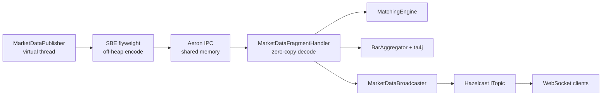
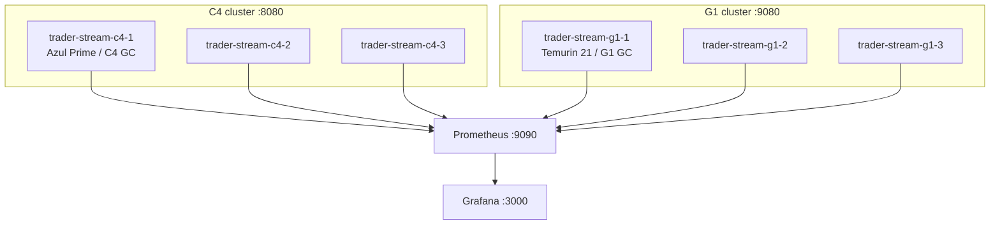
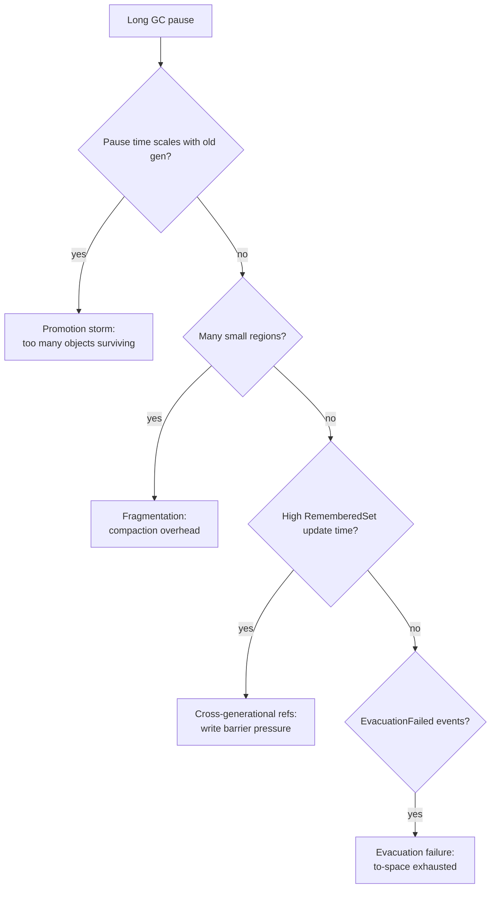

# Java Flight Recorder for Low-Latency Systems

## A hands-on workshop for JNation

Total time: 3 hours 30 minutes, broken into five modules. Each module ends with a hands-on exercise and a discussion checkpoint. You will leave with the application source, a generation script for the recordings, a printable analysis checklist, and reusable JFR event templates.

### What you will learn

By the end of this workshop you will be able to:

1. Identify the dominant cause of a GC pause from a JFR recording in under five minutes.
2. Distinguish young, mixed, and full collections by their JFR signatures.
3. Recognise the four common pathologies: promotion storms, fragmentation, remembered-set overhead, and evacuation failure.
4. Add custom `@Name`-annotated JFR events to correlate application behaviour with runtime events.
5. Compare two collectors objectively under identical workloads.

### Audience

Senior Java developers comfortable with Jakarta EE, virtual threads, and idiomatic Java 21. No prior JFR or HFT experience required. Bring a laptop with Docker, Git, and JDK Mission Control installed; see [README.md](./README.md) for setup details.

---

## Architecture you will be running



The application runs as two parallel clusters under Traefik:



Heap is identical on both sides (`-Xms4g -Xmx4g`, `AlwaysPreTouch`, transparent huge pages). The only deliberate difference is the garbage collector. That isolates GC behaviour as the dependent variable.

---

## Pre-workshop setup

Run this on your laptop before the session. Allow 20 minutes the first time.

```bash
git clone <repo-url>
cd trader-stream-ee
./workshop/scripts/verify-setup.sh
./start-comparison.sh all          # builds images, starts both clusters + monitoring
```

You should end up with:

|                    URL                    |         Purpose          |
|-------------------------------------------|--------------------------|
| `http://localhost:8080/trader-stream-ee/` | C4 cluster (Azul Prime)  |
| `http://localhost:9080/trader-stream-ee/` | G1 cluster (Temurin)     |
| `http://localhost:3000`                   | Grafana (admin/admin)    |
| `http://localhost:9090`                   | Prometheus               |
| `http://localhost:8084`                   | Traefik dashboard for C4 |
| `http://localhost:9084`                   | Traefik dashboard for G1 |

> **Ports 8080 / 9080 versus 8081 / 9081.** Health checks and UI traffic go through Traefik on the cluster ports (8080, 9080), which load-balances across all three instances. JFR commands and `/api/pressure/mode/*` calls in this workshop target the instance-1 direct ports (8081, 9081) so that recordings stay on a single JVM and end up in the bind-mounted `monitoring/recordings/{c4,g1}-1` directory.

JDK Mission Control installation:

- Azul Mission Control (free): <https://www.azul.com/products/components/azul-mission-control/>
- OpenJDK JMC build: <https://github.com/openjdk/jmc>
- Azul Platform Prime bundles JMC; if you install Prime on your laptop separately, you have JMC.

---

## Module 1: Setup and warm-up (30 min)

**Goal:** Get every attendee from clone to "I can open a real JFR recording in JMC" within 30 minutes.

### 1.1 Verify the clusters (5 min)

```bash
curl -s http://localhost:8080/trader-stream-ee/api/health/check | jq
curl -s http://localhost:9080/trader-stream-ee/api/health/check | jq
```

Both must return `"status": "healthy"`. If one is unhealthy, give it another 30 seconds; Payara Micro's deploy completes asynchronously.

### 1.2 Generate a baseline recording (10 min)

The application exposes a JFR REST API. We will start a 60-second recording while the publisher runs in steady mode.

```bash
# C4 baseline
curl -X POST 'http://localhost:8081/trader-stream-ee/api/jfr/recording/start?name=baseline&durationSeconds=60&settings=tradestream-workshop'

# G1 baseline
curl -X POST 'http://localhost:9081/trader-stream-ee/api/jfr/recording/start?name=baseline&durationSeconds=60&settings=tradestream-workshop'
```

The recording auto-stops after 60 seconds and dumps to disk. Find it:

```bash
ls -lh monitoring/recordings/c4-1/
ls -lh monitoring/recordings/g1-1/
```

### 1.3 Open in JMC (10 min)

```bash
jmc -open monitoring/recordings/c4-1/baseline-*.jfr
```

In JMC, open these pages:

1. **Outline → General → Garbage Collections** — the headline pause times.
2. **Outline → Memory → Allocation** — per-thread allocation rates.
3. **Outline → Threads** — find the publisher virtual thread.

### 1.4 Exercise: find the longest GC pause

Find the longest GC pause in your baseline recording. Note:

- Its duration in milliseconds.
- The collector that produced it (`G1 Young Generation`, `GPGC New`, etc.).
- The cause field (`G1 Evacuation Pause`, `Allocation Failure`, etc.).

Hint: in JMC, `Garbage Collections → Longest Pause` is one click. The duration column sorts in place. See [exercises/module-1-find-longest-pause/](./exercises/module-1-find-longest-pause/README.md) for hints and the expected output.

### Module 1 discussion checkpoint

Compare findings across the room. The C4 baseline should show pauses under 1 ms; the G1 baseline should show occasional young-gen pauses around 5-15 ms even under steady allocation. The interesting question is *why the difference exists at idle*, not just under stress.

---

## Module 2: Reading JFR recordings (60 min)

**Goal:** Build the mental model that lets you triage a JFR recording in five minutes.

### 2.1 GC events: what to read first (15 min)

JFR records dozens of GC event types. For pause analysis, three matter most:

|                      Event                      |                                        What it tells you                                        |
|-------------------------------------------------|-------------------------------------------------------------------------------------------------|
| `jdk.GarbageCollection`                         | Wall-clock pause time, cause, sum of phases. The headline.                                      |
| `jdk.GCPhasePause`                              | Per-phase pause breakdown (mark, evacuate, ref-processing, etc.). Where the time actually went. |
| `jdk.GCPhaseParallel` / `jdk.GCPhaseConcurrent` | Subphase work, useful for distinguishing root scanning from object copy.                        |

For G1 specifically: `jdk.G1HeapSummary`, `jdk.G1HeapRegionInformation`, `jdk.EvacuationInformation`, `jdk.EvacuationFailed`, `jdk.PromotionFailed`.

### 2.2 Pause time distributions (10 min)

Average pause time lies. Distributions tell the truth.

```mermaid
flowchart LR
    P50[P50 = "typical user feels"] --> P99
    P99[P99 = "what one in 100 requests hits"] --> P999
    P999[P99.9 = "the ones that cause incidents"] --> Max[Max = "the worst single pause"]
```

In JMC: `Outline → General → Garbage Collections → Pause Time` shows the histogram. Sort by duration descending. The first row is your Max. P99 lives roughly at the 99th-percentile mark of the cumulative distribution.

A 5-second recording at 60K msg/sec produces approximately 100 young collections under steady allocation. P99 over that sample size is barely meaningful. Workshop recordings are 60 seconds long for that reason, and even then your statistical confidence is limited; in production, recordings should be hours long for stable percentiles.

### 2.3 Young versus mixed versus full (10 min)

Look at the `Name` column in `Garbage Collections`:

|          Name pattern          |                     What G1 was doing                      |
|--------------------------------|------------------------------------------------------------|
| `G1 Young Generation` (Normal) | Young-only collection. Cheap.                              |
| `G1 Young Generation` (Mixed)  | Young plus some old regions. The expensive case.           |
| `G1 Full GC`                   | Whole-heap, stop-the-world. The "you have a problem" case. |
| `G1 Concurrent Cycle`          | Mark phases running with the application; not a pause.     |

C4 will show:

| Name pattern |           What C4 was doing            |
|--------------|----------------------------------------|
| `GPGC New`   | New-gen concurrent collection.         |
| `GPGC Old`   | Old-gen concurrent collection.         |
| Pause = 0 ms | Nearly always. C4 is fully concurrent. |

### 2.4 The four pathologies (15 min)



For each pathology there is one or two telltale events in JFR. See [analysis-checklist.md](./analysis-checklist.md) for the full triage tree.

### 2.5 Exercise: diagnose PROMOTION_STORM (15 min)

> **Pre-recorded files must exist before this module.** Run `./workshop/scripts/record-scenarios.sh` once during setup (about 16 minutes), or have the facilitator pre-generate them. The directory `workshop/recordings/` ships with only a README; the `.jfr` files are produced from your hardware.

Use the pre-recorded files:

```bash
jmc -open workshop/recordings/g1-promotion-storm.jfr
jmc -open workshop/recordings/c4-promotion-storm.jfr
```

Or generate fresh:

```bash
curl -X POST 'http://localhost:9081/trader-stream-ee/api/jfr/recording/start?name=promo-live&durationSeconds=75&settings=tradestream-workshop'
sleep 10
curl -X POST 'http://localhost:9081/trader-stream-ee/api/pressure/mode/PROMOTION_STORM'
sleep 60
curl -X POST 'http://localhost:9081/trader-stream-ee/api/pressure/mode/OFF'
```

In the G1 recording you should see:

- Young-gen collections becoming more frequent.
- The pause time gradually rising as old gen fills.
- `PromoteObjectOutsidePLAB` events climbing.
- Eventually a mixed collection with a noticeable pause.

In the C4 recording the same workload should produce no visible pause increase. Use this as the comparison anchor for Module 4. Full hints and expected outputs are in [exercises/module-2-diagnose-promotion-storm/](./exercises/module-2-diagnose-promotion-storm/README.md).

### Module 2 discussion checkpoint

Two questions to debate around the room:

1. If your production app has a P99 pause of 80 ms and a Max of 800 ms, which one do you optimise first, and why?
2. What recording duration would you need for the P99 to be statistically meaningful given 10 collections per minute?

---

## Module 3: Custom JFR events (45 min)

**Goal:** Add a domain-specific event that correlates application behaviour with GC events.

### 3.1 The shape of a custom event (10 min)

A custom event is a `public class extends jdk.jfr.Event` annotated with `@Name`, `@Label`, `@Category`, and optionally `@StackTrace(false)` for hot paths.

Two examples already in the codebase:

```java
// src/main/java/fish/payara/trader/jfr/MarketDataEvents.java
@Name("trade.published")
@Label("Trade Published")
@StackTrace(false)
public static class TradePublished extends Event {
    public String symbol;
    public long price;
    public int quantity;
    public String side;
}
```

```java
// emit it from MarketDataPublisher.java
TradePublished tradeEvent = new TradePublished();
if (tradeEvent.isEnabled()) {
    tradeEvent.symbol = symbol;
    tradeEvent.price = price;
    tradeEvent.quantity = qty;
    tradeEvent.side = side.name();
    tradeEvent.commit();
}
```

Critical detail: `event.isEnabled()` is the cost gate. When the event is disabled (recording stopped or this event type filtered out), `isEnabled()` returns `false` and the entire body is skipped. The JIT can sometimes eliminate the bare `new TradePublished()` allocation when the type is disabled, but it cannot eliminate any computation you do to compute the field values (string concatenation, lookups, formatting). The `isEnabled()` gate is what guarantees that field-population work runs only when JFR is recording the type.

`@StackTrace(false)` disables stack trace capture per emission. Stack traces are the most expensive part of a JFR event; for events that fire millions of times per second, leave them off.

### 3.2 Where to emit from (5 min)

Three principles for choosing emission points:

1. **One event per logical operation, not per method call.** Don't decorate every function; pick the boundary where the operation succeeded or failed.
2. **Numeric fields are cheap; String fields are not.** Strings get interned in the JFR string pool, but the interning lookup is hot-path overhead. Use enums-as-ints where possible.
3. **Begin/commit pairs measure duration.** Use `event.begin()` and `event.commit()` to capture the elapsed time of an operation automatically; JFR records the start, end, and thread.

### 3.3 Correlating with GC events (10 min)

In JMC, the `Event Browser` lets you overlay timelines. To see whether GC pauses cause SBE encoding stalls:

1. Open `Event Browser → Custom → Market Data → SBE Encode Operation`.
2. Open `Event Browser → Java Virtual Machine → GC → Pause`.
3. Drag both onto the same time axis.

A correlated stall looks like this:

```
GC pause:        [---50ms---]
SBE encode:  ............    .  .  .   .
                ^             ^
                stalls        catches up
```

If your SBE encode count drops to zero during the pause window, the publisher virtual thread is paused. If it does not drop, you have a virtual-thread carrier pinning problem - the publisher is running on a different carrier than the GC pause affected.

### 3.4 Exercise: track burst patterns (20 min)

Add a `BurstPatternEvent` that fires when the publisher detects a 5x rate spike. Starter code is at [`exercises/module-3-burst-event/BurstPatternEvent.starter.java`](./exercises/module-3-burst-event/BurstPatternEvent.starter.java).

The exercise walks through:

1. Define the event class with `@Name("burst.pattern.detected")`.
2. Add fields: `multiplier` (int), `windowMillis` (long), `peakRate` (double).
3. Wire it into `MarketDataPublisher.detectBurstMode()`.
4. Install with `./workshop/scripts/install-exercise.sh module-3-burst-event`.
5. Rebuild, re-record, and verify the event appears in `Event Browser → Custom`.
6. Build a custom JMC dashboard that overlays your event with `gc.sla.violation` and `aeron.backpressure`.

The completed dashboard XML is at [`exercises/module-3-burst-event/jmc-dashboard.xml`](./exercises/module-3-burst-event/jmc-dashboard.xml); import it via JMC's `File → Open → Custom Dashboard`.

### Module 3 discussion checkpoint

What would you instrument in your own application? What is the single hottest code path you currently have no visibility into?

---

## Module 4: Collector comparison (45 min)

**Goal:** Run identical workloads on C4 and G1, then read the resulting recordings as evidence.

### 4.1 The setup is already running (5 min)

Both clusters are healthy. You have already run baseline + PROMOTION_STORM on both. The remaining scenarios are:

|     Scenario     |                        What it stresses                         |
|------------------|-----------------------------------------------------------------|
| `GROWING_HEAP`   | Mixed collection scaling as live set grows from 100 MB to 2 GB. |
| `FRAGMENTATION`  | Compaction overhead under small-object churn.                   |
| `CROSS_GEN_REFS` | Write-barrier and remembered-set maintenance.                   |

For each scenario, the application's `MemoryPressureService` produces the exact allocation pattern; you don't need to write any code.

### 4.2 Generate (or use pre-recorded) (10 min)

Pre-recorded files are in `workshop/recordings/`. To save time, work from those. To produce fresh recordings:

```bash
./workshop/scripts/record-scenarios.sh
```

This takes about 16 minutes and produces all 10 .jfr files (~20-30 MB each).

### 4.3 Side-by-side analysis (20 min)

Open paired recordings in JMC:

```bash
jmc -open workshop/recordings/c4-fragmentation.jfr -open workshop/recordings/g1-fragmentation.jfr
```

For each pair, fill in this comparison table (template at [exercises/module-4-collector-comparison/comparison-template.md](./exercises/module-4-collector-comparison/comparison-template.md)):

|            Metric             | C4 | G1 | Why they differ |
|-------------------------------|----|----|-----------------|
| Max pause (ms)                |    |    |                 |
| P99 pause (ms)                |    |    |                 |
| GC throughput (% of app time) |    |    |                 |
| Old gen size at end           |    |    |                 |
| EvacuationFailed events       |    |    |                 |
| trade.published total         |    |    |                 |

For CLI-only comparison:

```bash
./workshop/scripts/compare-recordings.sh \
    workshop/recordings/c4-fragmentation.jfr \
    workshop/recordings/g1-fragmentation.jfr
```

### 4.4 Exercise: document the differences (10 min)

For each of the four stress scenarios, write a one-sentence summary of the behavioural difference. The expected answers (from real recordings) are in [exercises/module-4-collector-comparison/README.md](./exercises/module-4-collector-comparison/README.md).

### Module 4 discussion checkpoint

C4 is not always the right answer. Two questions worth debating:

1. For an application with a 99.9% pause budget of 200 ms, is the operational cost of running Azul Prime justified? What does the answer depend on?
2. If you change G1 to ZGC (also concurrent, ships with OpenJDK 21), how much of C4's behaviour do you reproduce? Where does ZGC still differ?

---

## Module 5: Applying to your applications (30 min)

**Goal:** Take the patterns from this workshop home to a real production application.

### 5.1 Pattern matching (10 min)

The four pathologies are not specific to trading systems. The closest analogues in common workloads:

|     Pathology      |                        Where it shows up outside HFT                         |
|--------------------|------------------------------------------------------------------------------|
| Promotion storm    | Caches with TTL > young-gen GC interval; pooled connection objects           |
| Fragmentation      | Long-lived applications with many distinct object sizes (logging frameworks) |
| Cross-gen refs     | Mutable singletons that hold references to recent request objects            |
| Evacuation failure | Heap sized too tight for the survivor space; allocation bursts               |

If you can recognise the JFR signature, you can diagnose any of these in any Java application.

### 5.2 Allocation versus collector choice (10 min)

The hardest call in performance work is: do I reduce allocation, or do I change collector?


Reducing allocation is almost always cheaper in production than changing JVM. The exception is when you have already optimised the hot paths (zero-copy, flyweight, primitive arrays) and the residual GC cost is still material.

### 5.3 Production-safe JFR (5 min)

Three rules for always-on JFR in production:

1. **Use the default profile, not workshop.** `-XX:StartFlightRecording=settings=default` is the 1%-overhead setting. The workshop profile is 1-2%; production-grade is what the JDK ships.
2. **Cap the size.** `maxsize=1g,maxage=24h` keeps recordings circular without unbounded disk growth.
3. **Disable stack traces on hot events.** `@StackTrace(false)` on every custom event you emit more than 1000 times per second.

Reference flags: see [exercises/module-5-apply-to-your-app/production-jfr-flags.md](./exercises/module-5-apply-to-your-app/production-jfr-flags.md).

### 5.4 Event templates (5 min)

Three reusable event templates for your own applications, in [exercises/module-5-apply-to-your-app/event-templates/](./exercises/module-5-apply-to-your-app/event-templates/):

|    Template     |                                         When to use it                                          |
|-----------------|-------------------------------------------------------------------------------------------------|
| `LatencyEvent`  | Wrap any function whose tail latency matters; uses `begin()`/`commit()` for automatic duration. |
| `ThrottleEvent` | Emit when a circuit breaker opens, a rate limit is hit, or backpressure activates.              |
| `ResourceEvent` | Emit when a finite resource (connection pool, file handle, cache slot) is reserved or released. |

Copy these into your own project, rename them, and start instrumenting.

### Q&A and open debugging

Bring your own production JFR recording if you have one. We'll spend the last few minutes walking through real attendee recordings.

---

## Takeaways

You leave with:

1. The TradeStreamEE repository, runnable on your laptop with Docker Compose.
2. Ten pre-recorded `.jfr` files covering five scenarios across two collectors.
3. The JFR analysis checklist ([analysis-checklist.md](./analysis-checklist.md)) - a printable two-page reference.
4. Three reusable event templates for your own applications.
5. A mental model: pathology → JFR signature → fix.

The repository will keep producing fresh recordings as you change scenarios or add events. Treat it as a sandbox, not a frozen artefact.

---

## Further reading

- JEP 328: Flight Recorder, the original proposal that ships JFR into OpenJDK.
- *Java Performance: The Definitive Guide* (Scott Oaks), chapter 5 on GC tuning.
- Azul C4 technical paper: <https://www.azul.com/products/components/azul-platform-prime/>
- G1 ergonomics tuning: <https://docs.oracle.com/en/java/javase/21/gctuning/garbage-first-g1-garbage-collector1.html>
- JMC user guide: <https://docs.oracle.com/en/java/java-components/jdk-mission-control/9/user-guide/>

